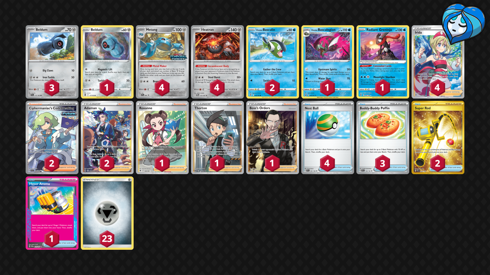

# Heatran/Metang

Tier **5** | Difficulty: **Easy** | Gameplan: **Midrange**

**Source**: ghumpkin - TrickyGym discord

## List
* 4 Metang PR-SV 90
* 3 Beldum TEF 113
* 1 Beldum SIT 117
* 4 Heatran TWM 123
* 1 Hisuian Basculegion LOR 45
* 2 Hisuian Basculin ASR 43
* 1 Radiant Greninja ASR 46
* 4 Irida ASR 186
* 3 Buddy-Buddy Poffin TEF 144
* 2 Ciphermaniac's Codebreaking TEF 198
* 2 Super Rod PAL 276
* 1 Hyper Aroma TWM 152
* 1 Roxanne ASR 188
* 1 Thorton LOR 195
* 4 Nest Ball SVI 181
* 1 Boss's Orders RCL 189
* 2 Adaman CRZ-GG 57
* 23 Basic {M} Energy Energy 16
