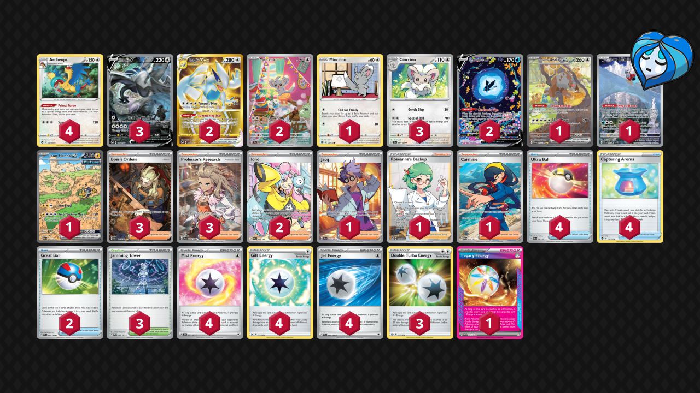

# Lugia/Archeops

Tier **2** | Difficulty: **Moderate** | Gameplan: **Toolbox**

**Source**: Isaiah Cheville - [Top 32 NAIC 2024, New Orleans](https://limitlesstcg.com/decks/list/11944)

## List
* 1 Minccino BRS 124
* 1 Bloodmoon Ursaluna ex TWM 216
* 4 Archeops SIT 147
* 1 Iron Bundle PR-SV 66
* 3 Lugia V SIT 186
* 2 Lugia VSTAR SIT 211
* 2 Minccino TEF 182
* 3 Cinccino TEF 137
* 1 Iron Hands ex PAR 248
* 2 Lumineon V CRZ-GG 39
* 4 Ultra Ball PAF 91
* 1 Jacq SVI 236
* 3 Boss's Orders PAL 265
* 3 Jamming Tower TWM 153
* 2 Great Ball PAL 183
* 1 Roseanne's Backup BRS 172
* 3 Professor's Research SVI 240
* 2 Iono PAL 254
* 4 Capturing Aroma SIT 153
* 1 Carmine TWM 204
* 4 Mist Energy TEF 161
* 4 Gift Energy LOR 171
* 3 Double Turbo Energy BRS 151
* 1 Legacy Energy TWM 167
* 4 Jet Energy PAL 190
