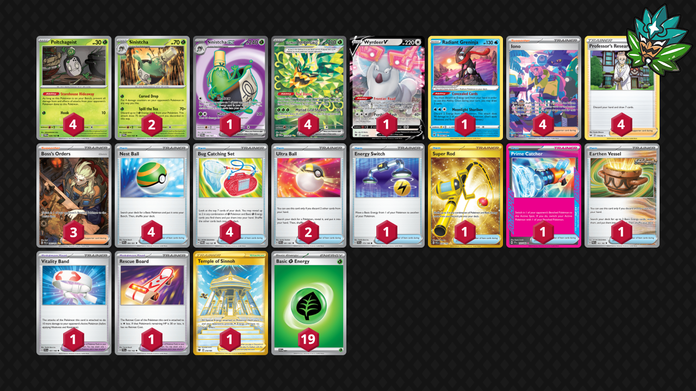

# Sinistcha/Ogerpon

Tier **5** | Difficulty: **Moderate** | Gameplan: **Midrange**

**Source**: Azul Garcia Griego - [Twitter post](https://x.com/Azul_GG/status/1793845356100485159)

## List
* 1 Wyrdeer V ASR 134
* 2 Sinistcha TWM 22
* 4 Teal Mask Ogerpon ex TWM 211
* 4 Poltchageist TWM 20
* 1 Sinistcha ex TWM 189
* 1 Radiant Greninja ASR 46
* 1 Vitality Band SVI 197
* 2 Ultra Ball PAF 91
* 3 Boss's Orders PAL 265
* 1 Energy Switch SVI 173
* 1 Super Rod PAL 276
* 4 Iono PAF 237
* 4 Professor's Research SSH 178
* 1 Prime Catcher TEF 157
* 1 Temple of Sinnoh ASR 214
* 1 Rescue Board TEF 159
* 4 Nest Ball PAF 84
* 4 Bug Catching Set TWM 143
* 1 Earthen Vessel PAR 163
* 19 Basic {G} Energy SVE 1
