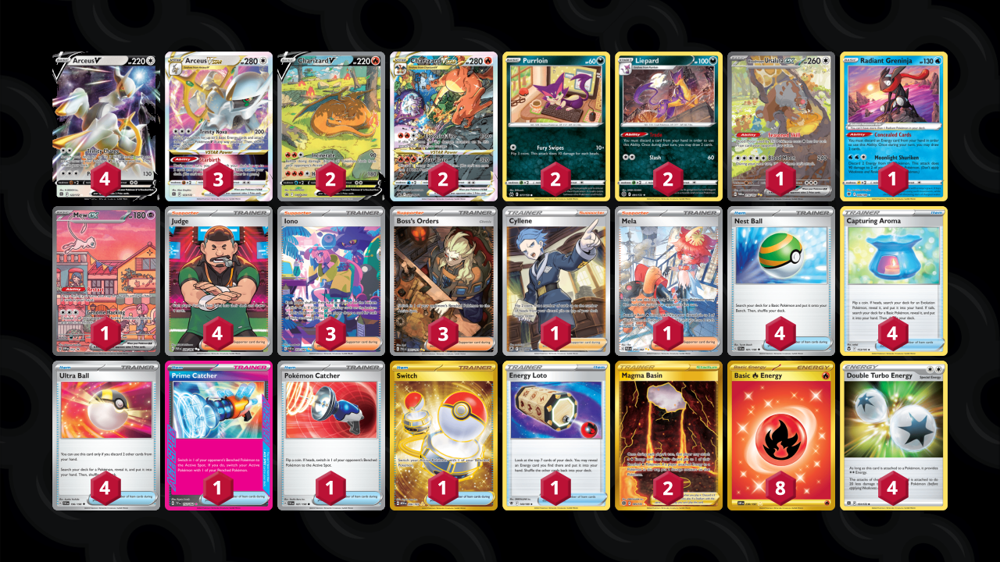

# Arceus/Charizard

Tier **5** | Difficulty: **Hard** | Gameplan: **Midrange**

**Source**: アルセウス研究所 はじめ - [Top 8 Pokémon Battle Park](https://play.limitlesstcg.com/tournament/66c2aae182e459668d364ba5/player/nrtcity/decklist)

## List
* 1 Bloodmoon Ursaluna ex TWM 216
* 3 Arceus VSTAR BRS 123
* 4 Arceus V BRS 122
* 2 Charizard V PR-SW 260
* 2 Charizard VSTAR PR-SW 262
* 2 Purrloin CRZ 77
* 2 Liepard BRS 91
* 1 Radiant Greninja ASR 46
* 1 Mew ex PR-SV 53
* 1 Cyllene ASR 183
* 4 Judge PAF 228
* 1 Mela PAR 254
* 1 Prime Catcher TEF 157
* 1 Pokémon Catcher SVI 187
* 4 Nest Ball SVI 181
* 4 Capturing Aroma SIT 153
* 3 Iono PAF 237
* 1 Switch MEW 206
* 3 Boss's Orders PAL 265
* 2 Magma Basin BRS 185
* 1 Energy Loto ASR 140
* 4 Ultra Ball SVI 196
* 4 Double Turbo Energy BRS 151
* 8 Basic {R} Energy OBF 230
