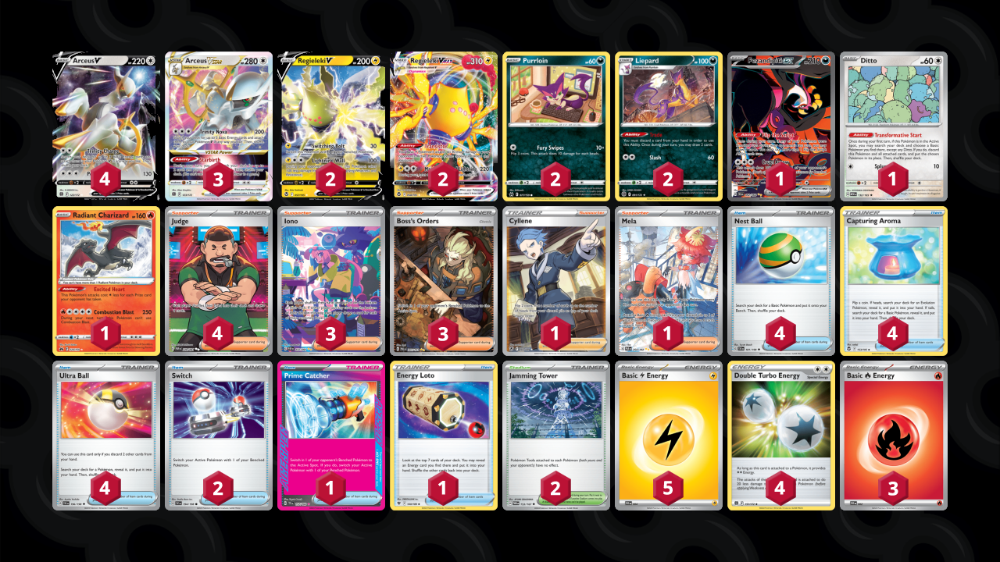

# Arceus/Regieleki

Tier **5** | Difficulty: **Moderate** | Gameplan: **Midrange**

**Source**: Ginerio - [1st Place The Couch TCG Season #2 Tournament #1](https://play.limitlesstcg.com/tournament/6612d139bd59c305cfa82698/player/ginerio/decklist)

## List
* 2 Regieleki V SIT 57
* 1 Fezandipiti ex SFA 92
* 1 Ditto MEW 132
* 3 Arceus VSTAR BRS 123
* 4 Arceus V BRS 122
* 1 Radiant Charizard CRZ 20
* 2 Purrloin CRZ 77
* 2 Liepard BRS 91
* 2 Regieleki VMAX SIT 58
* 1 Cyllene ASR 183
* 4 Judge PAF 228
* 1 Mela PAR 254
* 1 Prime Catcher TEF 157
* 4 Nest Ball SVI 181
* 4 Capturing Aroma SIT 153
* 3 Iono PAF 237
* 3 Boss's Orders PAL 265
* 2 Jamming Tower TWM 153
* 1 Energy Loto ASR 140
* 4 Ultra Ball SVI 196
* 2 Switch SVI 194
* 3 Basic {R} Energy SVE 2
* 5 Basic {L} Energy SVE 4
* 4 Double Turbo Energy BRS 151
