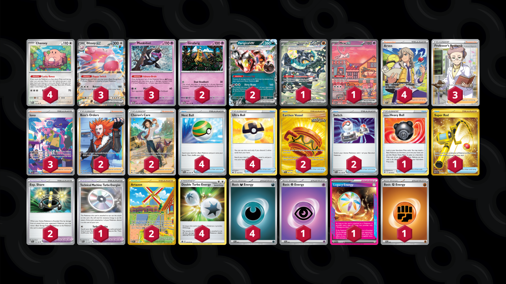

# Blissey/Farigiraf

Tier **5** | Difficulty: **Moderate** | Gameplan: **Tank and Heal**

**Source**: TcgTubbs - [Twitter post](https://x.com/TcgTubbs/status/1819814141168660757)

## List
* 2 Farigiraf ex TEF 108
* 3 Munkidori TWM 95
* 4 Chansey MEW 113
* 1 Cornerstone Mask Ogerpon ex TWM 215
* 2 Girafarig TWM 83
* 1 Mew ex PR-SV 53
* 3 Blissey ex TWM 134
* 1 Hisuian Heavy Ball ASR 146
* 1 Super Rod PAL 276
* 4 Nest Ball PAF 84
* 2 Artazon OBF 229
* 4 Ultra Ball CRZ 146
* 2 Boss's Orders LOR-TG 24
* 2 Exp. Share SVI 174
* 2 Earthen Vessel SFA 96
* 3 Professor's Research SSH 201
* 3 Iono PAF 237
* 2 Cheren's Care CRZ-GG 58
* 1 Technical Machine: Turbo Energize PAR 179
* 4 Arven SVI 235
* 2 Switch SVI 194
* 1 Basic {P} Energy SVE 5
* 1 Legacy Energy TWM 167
* 1 Basic {F} Energy SVE 6
* 4 Double Turbo Energy BRS 151
* 4 Basic {D} Energy SVE 7
