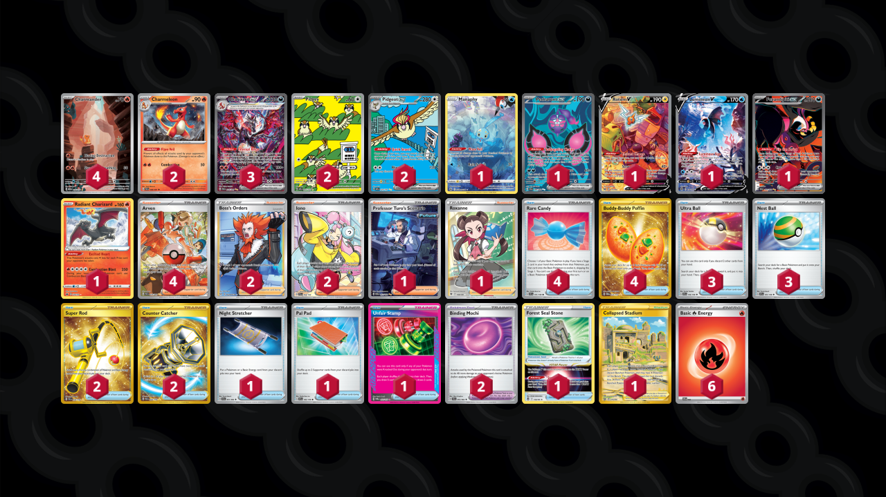

# Charizard/Pidgeot

Tier **2** | Difficulty: **Hard** | Gameplan: **Accumulate**

**Source**: SupahGassy - [Twitter post](https://x.com/SupahGassy/status/1821312307831435440)

## List
* 1 Manaphy CRZ-GG 6
* 1 Pecharunt ex SFA 85
* 1 Rotom V LOR 177
* 3 Charizard ex PAF 234
* 2 Pidgeot ex OBF 225
* 2 Pidgey OBF 207
* 1 Lumineon V BRS 156
* 1 Fezandipiti ex SFA 92
* 4 Charmander MEW 168
* 2 Charmeleon PAF 8
* 1 Radiant Charizard CRZ 20
* 3 Ultra Ball SVI 196
* 4 Rare Candy SVI 191
* 4 Arven PAF 235
* 2 Super Rod PAL 276
* 1 Professor Turo's Scenario PAR 257
* 2 Boss's Orders LOR-TG 24
* 1 Night Stretcher SFA 61
* 1 Roxanne ASR 188
* 4 Buddy-Buddy Poffin TWM 223
* 1 Pal Pad SVI 182
* 1 Forest Seal Stone SIT 156
* 2 Iono PAL 254
* 1 Collapsed Stadium LOR 215
* 3 Nest Ball SVI 181
* 1 Unfair Stamp TWM 165
* 2 Counter Catcher PAR 264
* 2 Binding Mochi SFA 55
* 6 Basic {R} Energy SVE 2
