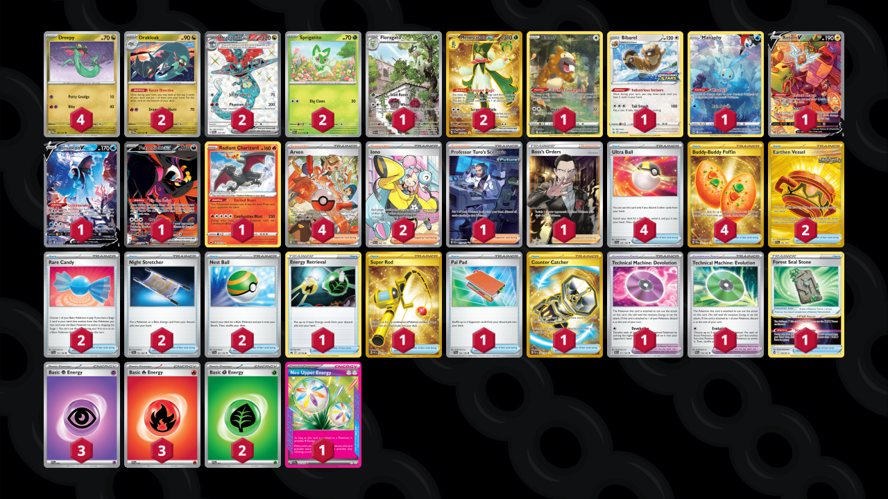

# Dragapult/Meowscarada

Tier **5** | Difficulty: **Hard** | Gameplan: **Spread**

**Source**: Sapphire Soul27 - [Twitter post](https://x.com/Sapphire_Soul27/status/1830743386405634453)

## List
* 1 Manaphy CRZ-GG 6
* 1 Bibarel PR-SW 188
* 1 Rotom V LOR 177
* 2 Sprigatito PAL 13
* 2 Drakloak TWM 129
* 4 Dreepy TWM 128
* 2 Meowscarada ex PAL 271
* 1 Lumineon V BRS 156
* 1 Fezandipiti ex SFA 92
* 1 Floragato PAL 197
* 2 Dragapult ex TWM 200
* 1 Bidoof CRZ-GG 29
* 1 Radiant Charizard CRZ 20
* 4 Ultra Ball SVI 196
* 2 Earthen Vessel SFA 96
* 1 Energy Retrieval CRZ 127
* 2 Rare Candy SVI 191
* 4 Arven PAF 235
* 1 Super Rod PAL 276
* 1 Professor Turo's Scenario PAR 257
* 1 Technical Machine: Devolution PAR 177
* 2 Night Stretcher SFA 61
* 1 Technical Machine: Evolution PAR 178
* 4 Buddy-Buddy Poffin TWM 223
* 1 Pal Pad SVI 182
* 1 Forest Seal Stone SIT 156
* 2 Iono PAL 254
* 2 Nest Ball SVI 181
* 1 Counter Catcher PAR 264
* 1 Boss's Orders RCL 189
* 3 Basic {P} Energy SVE 5
* 2 Basic {G} Energy SVE 1
* 3 Basic {R} Energy SVE 2
* 1 Neo Upper Energy TEF 162
