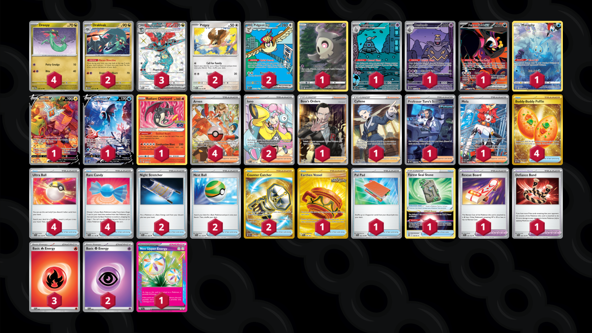

# Dragapult/Pidgeot

Tier **4** | Difficulty: **Hard** | Gameplan: **Accumulate Spread**

**Source**: OnGaardTV - [Twitter post](https://x.com/OnGaardTV/status/1820136432343921147)

## List
* 2 Pidgey MEW 16
* 2 Pidgeot ex OBF 225
* 1 Fezandipiti ex SFA 92
* 2 Drakloak TWM 129
* 1 Manaphy CRZ-GG 6
* 4 Dreepy TWM 128
* 1 Rotom V LOR 177
* 1 Lumineon V BRS 156
* 1 Duskull CRZ-GG 28
* 1 Dusclops SFA 69
* 1 Dusknoir SFA 70
* 1 Radiant Charizard PGO 11
* 3 Dragapult ex TWM 200
* 1 Boss's Orders RCL 189
* 4 Buddy-Buddy Poffin TWM 223
* 2 Iono PAL 254
* 1 Cyllene ASR 183
* 1 Forest Seal Stone SIT 156
* 1 Professor Turo's Scenario PAR 257
* 1 Earthen Vessel SFA 96
* 2 Night Stretcher SFA 61
* 1 Rescue Board TEF 159
* 1 Pal Pad SVI 182
* 2 Nest Ball SVI 181
* 4 Arven PAF 235
* 1 Mela PAR 236
* 1 Defiance Band SVI 169
* 2 Counter Catcher PAR 264
* 4 Ultra Ball SVI 196
* 4 Rare Candy SVI 191
* 2 Basic {P} Energy SVE 5
* 3 Basic {R} Energy SVE 2
* 1 Neo Upper Energy TEF 162
