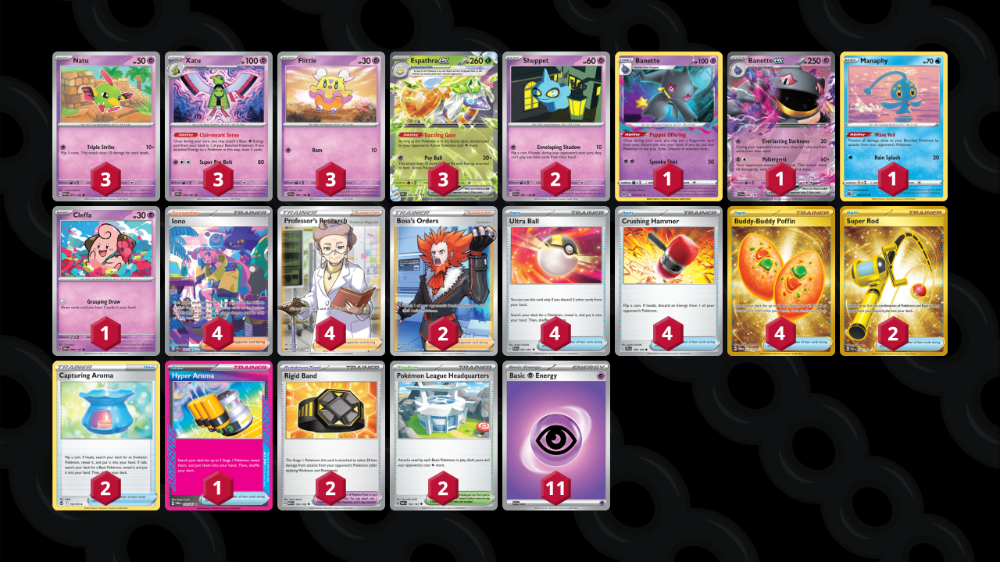

# Espathra/Xatu

Tier **4** | Difficulty: **Moderate** | Gameplan: **Accumulate Disruption**

**Source**: Braiden Elfert - [Twitter post](https://x.com/BraidenElfert/status/1829388325196607655)

## List
* 1 Banette LOR 73
* 2 Shuppet SVI 87
* 3 Espathra ex PAF 6
* 3 Xatu PAF 26
* 1 Manaphy BRS 41
* 3 Natu PAR 71
* 3 Flittle SVI 100
* 1 Cleffa OBF 80
* 1 Banette ex SVI 88
* 4 Ultra Ball PAF 91
* 4 Crushing Hammer SVI 168
* 2 Super Rod PAL 276
* 4 Iono PAF 237
* 1 Hyper Aroma TWM 152
* 2 Boss's Orders LOR-TG 24
* 2 Rigid Band MEW 165
* 4 Buddy-Buddy Poffin TWM 223
* 2 Pokémon League Headquarters OBF 192
* 2 Capturing Aroma SIT 153
* 4 Professor's Research SSH 201
* 11 Basic {P} Energy SVE 5
