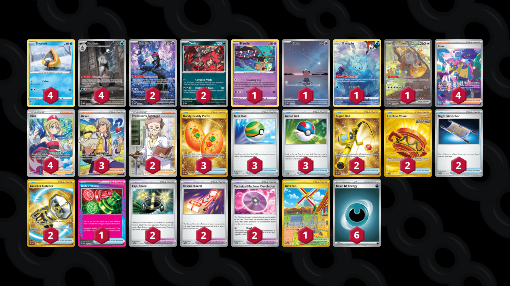

# Froslass/Munkidori

* [Bloodmoon Ursaluna ex](#bloodmoon-ursaluna-ex)
* [Iron Jugulis](#iron-jugulis)

## Bloodmoon Ursaluna ex

Tier **4** | Difficulty: **Hard** | Gameplan: **Spread**

**Source**: facundo romero - [Top 8 Evolve Thursday Night #7](https://play.limitlesstcg.com/tournament/66ace4b982e459668d352911/player/fatpotatoee/decklist)

[top](#froslassmunkidori)

### List
* 1 Mawile LOR 71
* 2 Munkidori SFA 72
* 1 Cleffa OBF 202
* 1 Manaphy CRZ-GG 6
* 4 Snorunt SIT 41
* 1 Bloodmoon Ursaluna ex TWM 216
* 2 Yveltal SFA 35
* 4 Froslass TWM 174
* 3 Buddy-Buddy Poffin TWM 223
* 1 Unfair Stamp TWM 165
* 2 Super Rod PAL 276
* 1 Artazon OBF 229
* 2 Exp. Share SVI 174
* 2 Earthen Vessel SFA 96
* 2 Night Stretcher SFA 61
* 2 Rescue Board TEF 159
* 3 Nest Ball SVI 181
* 2 Professor's Research SSH 201
* 4 Iono PAF 237
* 2 Technical Machine: Devolution PAR 177
* 3 Great Ball PAL 183
* 3 Arven SVI 235
* 2 Counter Catcher PAR 264
* 4 Irida ASR 186
* 6 Basic {D} Energy SVE 7

## Iron Jugulis

Tier **F** | Difficulty: **Hard** | Gameplan: **Spread**

**Source**: NataliePokeTCG - [Twitter post](https://x.com/NataliePokeTCG/status/1804360275111342447)

[top](#froslassmunkidori)

### List
* 1 Mawile LOR 71
* 2 Munkidori SFA 72
* 4 Snorunt TWM 51
* 3 Iron Jugulis PAR 216
* 4 Froslass TWM 174
* 4 Yveltal SFA 35
* 2 Switch SVI 194
* 4 Arven SVI 235
* 2 Exp. Share SVI 174
* 2 Energy Switch SVI 173
* 2 Super Rod PAL 276
* 3 Iono PAF 237
* 1 Technical Machine: Devolution PAR 177
* 2 Technical Machine: Evolution PAR 178
* 2 Buddy-Buddy Poffin TWM 223
* 4 Nest Ball SVI 181
* 3 Gapejaw Bog ASR 142
* 2 Counter Catcher PAR 264
* 1 Unfair Stamp TWM 165
* 1 Lana's Aid TWM 207
* 1 Boss's Orders RCL 189
* 2 Professor's Research SSH 201
* 6 Basic {D} Energy SVE 7
* 2 Double Turbo Energy BRS 151
