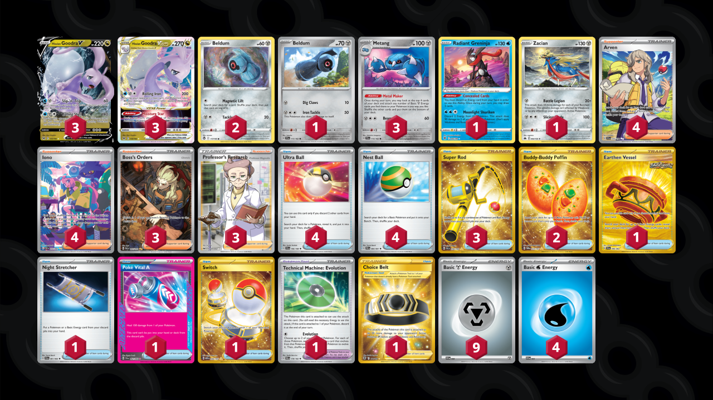

# Goodra/Metang

Tier **F** | Difficulty: **Moderate** | Gameplan: **Tank and Heal**

**Source**: LittleDarkFury - [YouTube video](www.youtube.com/watch?v=MsreNHbJE2Y)

## List
* 1 Beldum TEF 113
* 2 Beldum SIT 117
* 3 Hisuian Goodra VSTAR LOR 136
* 3 Hisuian Goodra V LOR 135
* 1 Radiant Greninja ASR 46
* 3 Metang TEF 114
* 1 Zacian CRZ 94
* 4 Ultra Ball SVI 196
* 4 Arven SVI 235
* 1 Earthen Vessel SFA 96
* 3 Boss's Orders PAL 265
* 3 Super Rod PAL 276
* 4 Iono PAF 237
* 1 Night Stretcher SFA 61
* 1 Poké Vital A SFA 62
* 1 Technical Machine: Evolution PAR 178
* 1 Choice Belt ASR 211
* 2 Buddy-Buddy Poffin TWM 223
* 4 Nest Ball PAF 84
* 1 Switch MEW 206
* 3 Professor's Research SSH 201
* 4 Basic {W} Energy SVE 3
* 9 Basic {M} Energy SVE 8
