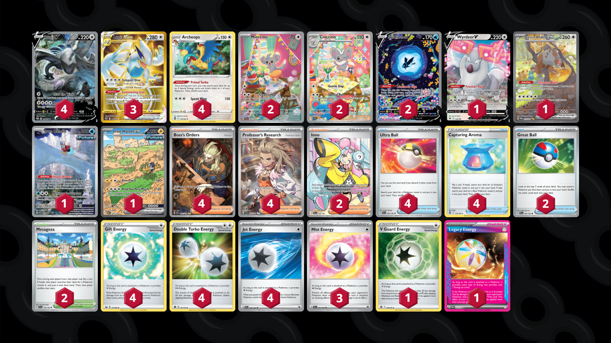

# Lugia/Archeops

Tier **2** | Difficulty: **Moderate** | Gameplan: **Midrange Toolbox**

**Source**: Konsta Kallama - [Top 16 World Championships 2024]()

## List
* 1 Wyrdeer V ASR 134
* 1 Bloodmoon Ursaluna ex TWM 216
* 4 Archeops SIT 147
* 1 Iron Bundle PR-SV 66
* 4 Lugia V SIT 186
* 3 Lugia VSTAR SIT 211
* 2 Minccino TEF 182
* 2 Cinccino TEF 183
* 1 Iron Hands ex PAR 248
* 2 Lumineon V CRZ-GG 39
* 4 Ultra Ball SVI 196
* 4 Boss's Orders PAL 265
* 2 Mesagoza SVI 178
* 2 Great Ball PAL 183
* 4 Professor's Research SVI 240
* 2 Iono PAL 254
* 4 Capturing Aroma SIT 153
* 3 Mist Energy TEF 161
* 1 V Guard Energy SIT 169
* 4 Gift Energy LOR 171
* 4 Double Turbo Energy BRS 151
* 1 Legacy Energy TWM 167
* 4 Jet Energy PAL 190
