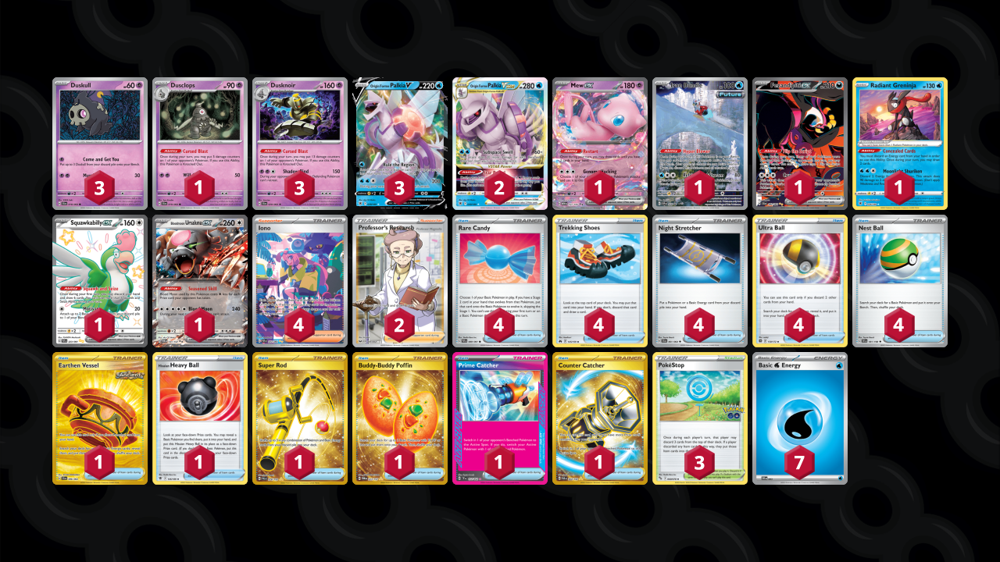

# Palkia/Dusknoir

Tier **5** | Difficulty: **Hard** | Gameplan: **Midrange**

**Source**: Danny House - [Twitter post](https://x.com/HusDanny/status/1832442858663768459)

## List
* 1 Dusclops SFA 19
* 1 Mew ex MEW 151
* 1 Iron Bundle PR-SV 66
* 3 Duskull SFA 18
* 3 Origin Forme Palkia V ASR 39
* 1 Fezandipiti ex SFA 92
* 2 Origin Forme Palkia VSTAR ASR 40
* 1 Radiant Greninja ASR 46
* 1 Squawkabilly ex PAF 223
* 1 Bloodmoon Ursaluna ex TWM 141
* 3 Dusknoir SFA 20
* 4 Rare Candy PAF 89
* 1 Earthen Vessel SFA 96
* 4 Trekking Shoes CRZ 145
* 1 Hisuian Heavy Ball ASR 146
* 1 Super Rod PAL 276
* 4 Iono PAF 237
* 3 PokéStop PGO 68
* 4 Night Stretcher SFA 61
* 4 Ultra Ball BRS 150
* 1 Buddy-Buddy Poffin TWM 223
* 1 Prime Catcher TEF 157
* 4 Nest Ball SVI 181
* 1 Counter Catcher PAR 264
* 2 Professor's Research SSH 201
* 7 Basic {W} Energy SVE 3
