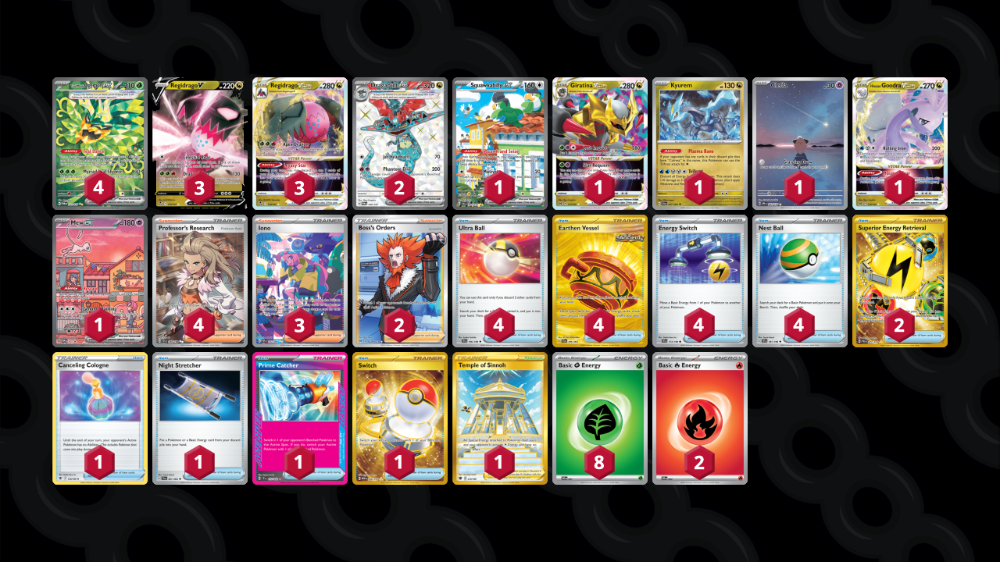

# Regidrago/Ogerpon

Tier **1** | Difficulty: **Hard** | Gameplan: **Midrange Toolbox**

**Source**: Raz Wolpe - [4th Place World Championships 2024](https://limitlesstcg.com/decks/list/12216)

## List
* 1 Squawkabilly ex PAL 264
* 1 Giratina VSTAR LOR 131
* 4 Teal Mask Ogerpon ex TWM 211
* 1 Kyurem SFA 47
* 1 Cleffa OBF 202
* 3 Regidrago V SIT 135
* 3 Regidrago VSTAR SIT 136
* 1 Hisuian Goodra VSTAR LOR 136
* 2 Dragapult ex TWM 200
* 1 Mew ex PR-SV 53
* 4 Ultra Ball SVI 196
* 4 Earthen Vessel SFA 96
* 1 Canceling Cologne ASR 136
* 4 Energy Switch SVI 173
* 3 Iono PAF 237
* 2 Superior Energy Retrieval PAL 277
* 2 Boss's Orders LOR-TG 24
* 1 Night Stretcher SFA 61
* 1 Prime Catcher TEF 157
* 4 Professor's Research SVI 240
* 1 Temple of Sinnoh ASR 214
* 4 Nest Ball SVI 181
* 1 Switch MEW 206
* 8 Basic {G} Energy SVE 1
* 2 Basic {R} Energy SVE 2
