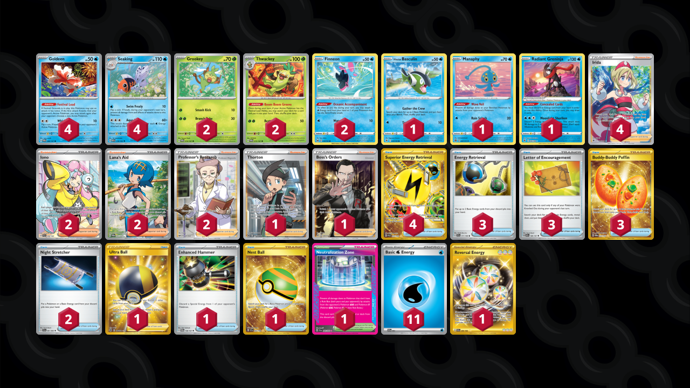

# Seaking/Thwackey

Tier **5** | Difficulty: **Hard** | Gameplan: **Midrange**

**Source**: ian steel - [4th Place Sunny's Weekly #167](https://play.limitlesstcg.com/tournament/66c394de82e459668d364ef5/player/bxnin/decklist)

## List
* 4 Seaking MEW 119
* 2 Thwackey TWM 15
* 2 Finneon LOR 40
* 1 Hisuian Basculin ASR 43
* 1 Manaphy BRS 41
* 1 Radiant Greninja ASR 46
* 2 Grookey TWM 14
* 4 Goldeen TWM 44
* 4 Irida ASR 186
* 3 Energy Retrieval SVI 171
* 4 Superior Energy Retrieval PAL 277
* 3 Letter of Encouragement OBF 189
* 1 Ultra Ball BRS 186
* 2 Night Stretcher SFA 61
* 1 Thorton LOR 195
* 3 Buddy-Buddy Poffin TWM 223
* 2 Iono PAL 254
* 2 Lana's Aid TWM 207
* 1 Boss's Orders RCL 189
* 1 Neutralization Zone SFA 60
* 2 Professor's Research SSH 201
* 1 Enhanced Hammer TWM 148
* 1 Nest Ball SVI 255
* 11 Basic {W} Energy SVE 3
* 1 Reversal Energy PAR 266
