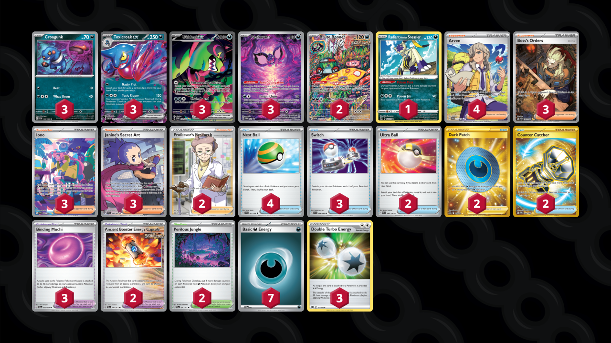

# Toxicroak/Okidogi

Tier **F** | Difficulty: **Moderate** | Gameplan: **Midrange**

**Source**: Nitram - TrickyGym discord

## List
* 3 Okidogi ex SFA 90
* 2 Brute Bonnet PAR 207
* 3 Croagunk SVI 130 PH
* 1 Radiant Hisuian Sneasler LOR 123
* 3 Toxicroak ex SVI 131
* 3 Pecharunt PR-SV 129
* 2 Ultra Ball SVI 196
* 3 Switch SVI 194
* 4 Arven SVI 235
* 3 Boss's Orders PAL 265
* 2 Ancient Booster Energy Capsule TEF 140
* 3 Iono PAF 237
* 2 Perilous Jungle TEF 156
* 4 Nest Ball SVI 181
* 3 Janine's Secret Art SFA 88
* 2 Dark Patch LOR 216
* 2 Counter Catcher PAR 264
* 3 Binding Mochi SFA 55
* 2 Professor's Research SSH 201
* 7 Basic {D} Energy SVE 7
* 3 Double Turbo Energy BRS 151
