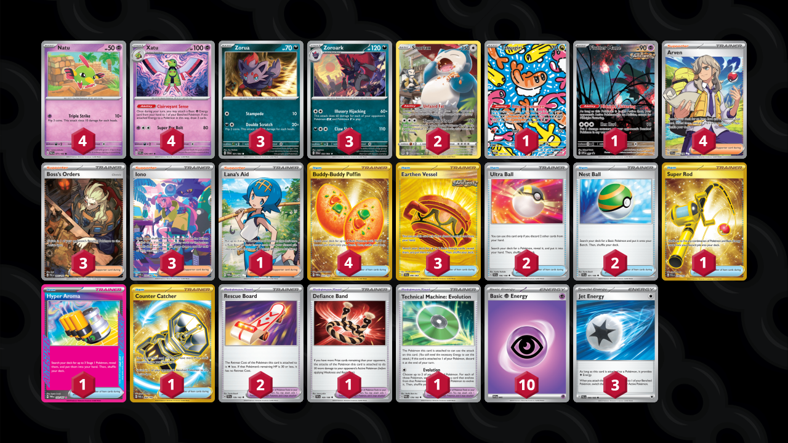

# Zoroark/Xatu

Tier **F** | Difficulty: **Moderate** | Gameplan: **Midrange**

**Source**: ForTheWinTCG - [YouTube video](www.youtube.com/watch?v=GgxHYlVJjVQ)

## List
* 1 Tatsugiri TWM 186
* 4 Xatu PAF 26
* 1 Flutter Mane PR-SV 97
* 3 Zorua SFA 31
* 3 Zoroark SFA 32
* 4 Natu PAR 71
* 2 Snorlax LOR-TG 10
* 2 Ultra Ball SVI 196
* 4 Arven SVI 235
* 3 Earthen Vessel SFA 96
* 3 Boss's Orders PAL 265
* 1 Defiance Band SVI 169
* 1 Super Rod PAL 276
* 3 Iono PAF 237
* 1 Hyper Aroma TWM 152
* 1 Technical Machine: Evolution PAR 178
* 4 Buddy-Buddy Poffin TWM 223
* 2 Nest Ball SVI 181
* 2 Rescue Board TEF 159
* 1 Counter Catcher PAR 264
* 1 Lana's Aid TWM 207
* 10 Basic {P} Energy SVE 5
* 3 Jet Energy PAL 190
