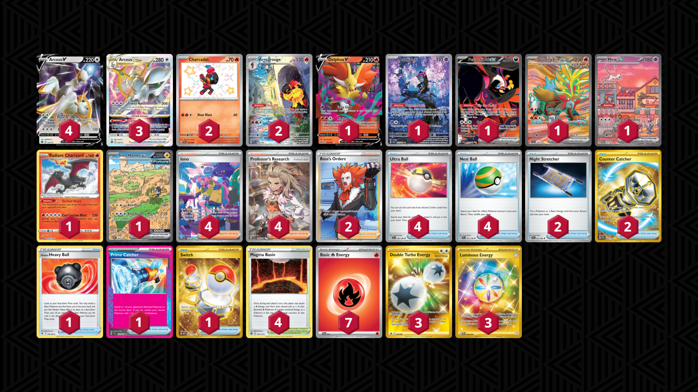

# Arceus/Armarouge

Tier **3** | Difficulty: **Hard** | Gameplan: **Midrange Toolbox**

**Source**: Carter Malnaik - [Day 2 Regional Louisville, KY](https://x.com/ebsc93/status/1835641090650644967)

## List
* 2 Charcadet PAF 114
* 2 Armarouge SVI 203
* 3 Arceus VSTAR BRS 123
* 4 Arceus V BRS 122
* 1 Delphox V LOR 27
* 1 Munkidori SFA 72
* 1 Fezandipiti ex SFA 92
* 1 Gouging Fire ex TEF 188
* 1 Mew ex PR-SV 53
* 1 Radiant Charizard CRZ 20
* 1 Iron Hands ex PAR 248
* 4 Ultra Ball SVI 196
* 1 Hisuian Heavy Ball ASR 146
* 4 Iono PAF 237
* 2 Boss's Orders LOR-TG 24
* 2 Night Stretcher SFA 61
* 4 Professor's Research SVI 240
* 1 Prime Catcher TEF 157
* 4 Nest Ball SVI 181
* 2 Counter Catcher PAR 264
* 1 Switch MEW 206
* 4 Magma Basin BRS 144
* 3 Double Turbo Energy ASR 216
* 3 Luminous Energy TWM 226
* 7 Basic {R} Energy SVE 2
