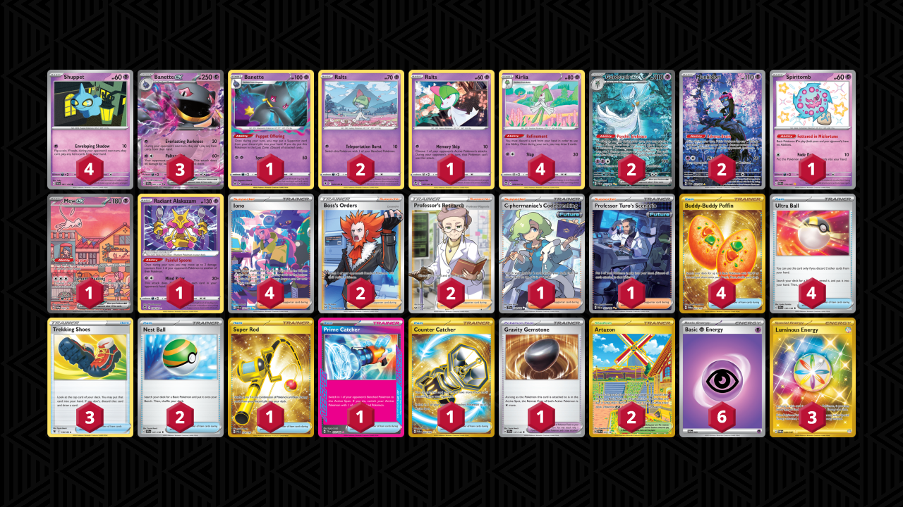

# Banette/Gardevoir

Tier **1** | Difficulty: **Extreme** | Gameplan: **Disruption**

**Source**: Mateusz Łaszkiewicz - [Top 16 Regional Dortmund](https://limitlesstcg.com/decks/list/12981)

## List
* 1 Banette LOR 73
* 2 Munkidori SFA 72
* 1 Spiritomb PAF 158
* 4 Kirlia SIT 68
* 1 Ralts SIT 67
* 2 Gardevoir ex PAF 233
* 4 Shuppet SVI 87
* 3 Banette ex SVI 88
* 2 Ralts ASR 60
* 1 Mew ex PR-SV 53
* 1 Radiant Alakazam SIT 59
* 3 Trekking Shoes ASR 156
* 4 Buddy-Buddy Poffin TWM 223
* 1 Super Rod PAL 276
* 2 Artazon OBF 229
* 1 Ciphermaniac's Codebreaking TEF 198
* 1 Professor Turo's Scenario PAR 257
* 2 Boss's Orders LOR-TG 24
* 1 Prime Catcher TEF 157
* 2 Nest Ball SVI 181
* 2 Professor's Research SSH 201
* 4 Iono PAF 237
* 1 Counter Catcher PAR 264
* 1 Gravity Gemstone SCR 137
* 4 Ultra Ball SVI 196
* 3 Luminous Energy TWM 226
* 6 Basic {P} Energy SVE 5
