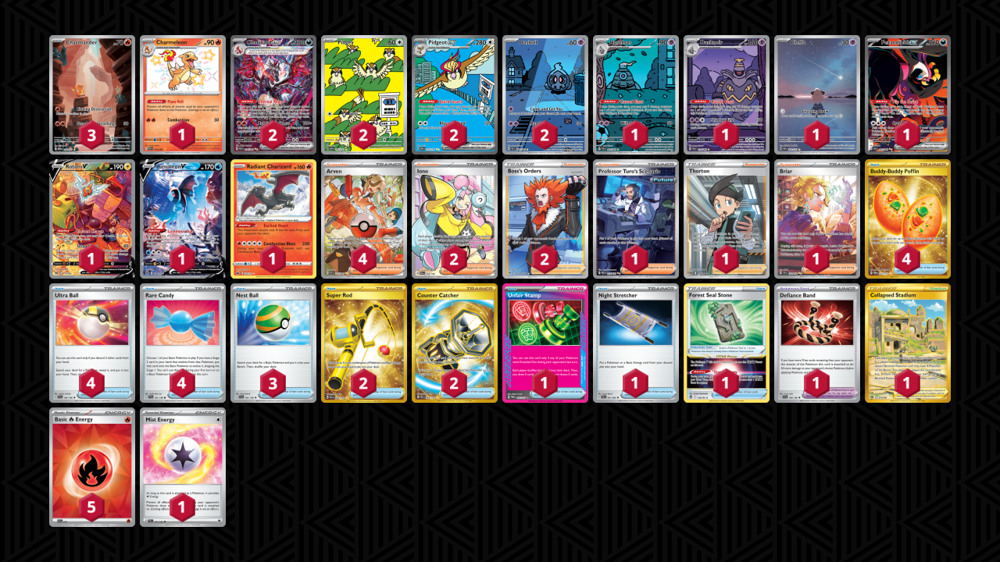
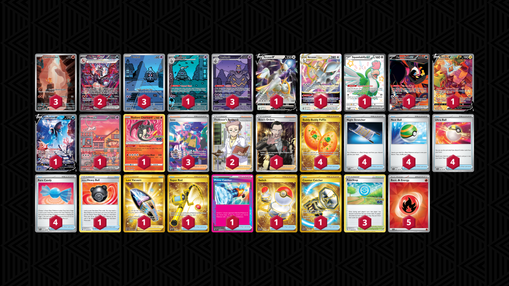

# Charizard ex

* [Pidgeot ex](#pidgeot-ex)
* [PokéStop](#pokéstop)

## Pidgeot ex

Tier **1** | Difficulty: **Hard** | Gameplan: **Accumulate**

**Source**: Sebastian Lashmet - [4th Place Regional Louisville, KY](https://limitlesstcg.com/decks/list/13167)

[top](#charizard-ex)

### List
* 2 Pidgey OBF 207
* 1 Charmeleon PAF 110
* 1 Cleffa OBF 202
* 2 Pidgeot ex OBF 225
* 1 Fezandipiti ex SFA 92
* 3 Charmander MEW 168
* 2 Duskull SFA 68
* 2 Charizard ex PAF 234
* 1 Rotom V LOR 177
* 1 Lumineon V BRS 156
* 1 Radiant Charizard CRZ 20
* 1 Dusclops SFA 69
* 1 Dusknoir SFA 70
* 1 Collapsed Stadium LOR 215
* 4 Buddy-Buddy Poffin TWM 223
* 2 Iono PAL 254
* 1 Unfair Stamp TWM 165
* 2 Super Rod PAL 276
* 1 Forest Seal Stone SIT 156
* 1 Professor Turo's Scenario PAR 257
* 2 Boss's Orders LOR-TG 24
* 1 Night Stretcher SFA 61
* 3 Nest Ball SVI 181
* 4 Arven PAF 235
* 1 Thorton LOR 195
* 1 Briar SCR 171
* 1 Defiance Band SVI 169
* 2 Counter Catcher PAR 264
* 4 Ultra Ball SVI 196
* 4 Rare Candy SVI 191
* 5 Basic {R} Energy SVE 10
* 1 Mist Energy TEF 161

## PokéStop

Tier **3** | Difficulty: **Medium** | Gameplan: **Turbo**

**Source**: Andrew Mahone - TrickyGym discord

[top](#charizard-ex)

### List
* 1 Squawkabilly ex PAF 223
* 1 Fezandipiti ex SFA 92
* 3 Charmander MEW 168
* 3 Duskull SFA 68
* 2 Charizard ex PAF 234
* 1 Arceus VSTAR BRS 123
* 1 Rotom V LOR 177
* 1 Arceus V BRS 122
* 1 Lumineon V BRS 156
* 1 Dusclops SFA 69
* 1 Mew ex PR-SV 53
* 3 Dusknoir SFA 70
* 1 Radiant Charizard PGO 11
* 1 Boss's Orders RCL 189
* 1 Hisuian Heavy Ball ASR 146
* 4 Buddy-Buddy Poffin TWM 223
* 1 Lost Vacuum LOR 217
* 3 PokéStop PGO 68
* 1 Super Rod PAL 276
* 1 Prime Catcher TEF 157
* 4 Night Stretcher SFA 61
* 4 Nest Ball SVI 181
* 2 Professor's Research SSH 201
* 3 Iono PAF 237
* 1 Switch MEW 206
* 1 Counter Catcher PAR 264
* 4 Ultra Ball SVI 196
* 4 Rare Candy SVI 191
* 5 Basic {R} Energy SVE 10
