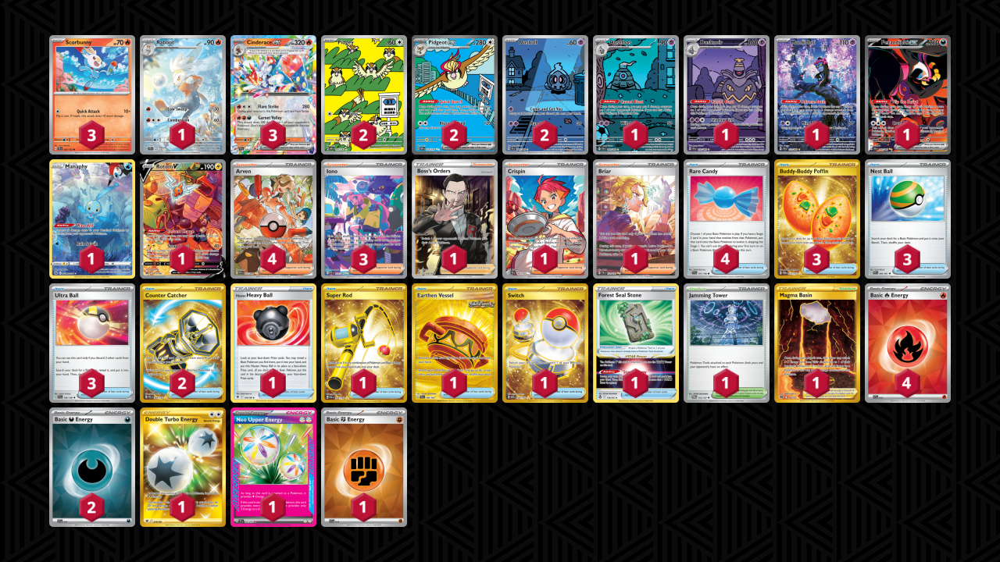
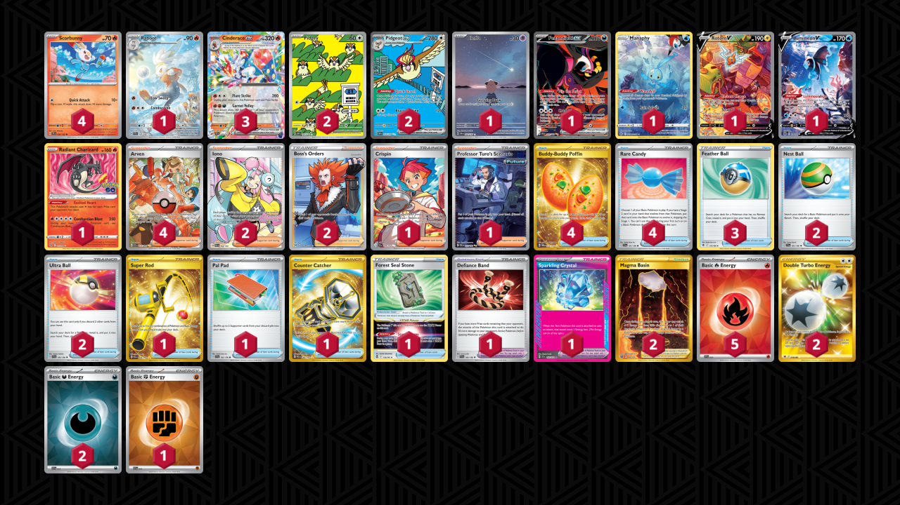

# Cinderace/Pidgeot

* [Cursed Blast Dusknoir](#)
* [Radiant Charizard](#)

## Cursed Blast Dusknoir

Tier **4** | Difficulty: **Hard** | Gameplan: **Accumulate**

**Source**: Popsicle Knight - [YouTube video](www.youtube.com/watch?v=fVc070srpRU)

[top](#cinderacepidgeot)

### List
* 1 Raboot SCR 147
* 1 Munkidori SFA 72
* 2 Pidgey OBF 207
* 2 Pidgeot ex OBF 225
* 1 Fezandipiti ex SFA 92
* 3 Cinderace ex SCR 28
* 1 Manaphy CRZ-GG 6
* 3 Scorbunny SCR 26
* 2 Duskull SFA 68
* 1 Rotom V LOR 177
* 1 Dusclops SFA 69
* 1 Dusknoir SFA 70
* 1 Boss's Orders RCL 189
* 1 Hisuian Heavy Ball ASR 146
* 3 Buddy-Buddy Poffin TWM 223
* 1 Crispin SCR 164
* 1 Super Rod PAL 276
* 3 Nest Ball PAF 84
* 1 Forest Seal Stone SIT 156
* 1 Earthen Vessel SFA 96
* 4 Arven PAF 235
* 3 Iono PAF 237
* 1 Switch MEW 206
* 1 Jamming Tower TWM 153
* 1 Briar SCR 171
* 1 Magma Basin BRS 185
* 2 Counter Catcher PAR 264
* 3 Ultra Ball SVI 196
* 4 Rare Candy SVI 191
* 4 Basic {R} Energy SVE 10
* 1 Double Turbo Energy ASR 216
* 2 Basic {D} Energy SVE 15
* 1 Neo Upper Energy TEF 162
* 1 Basic {F} Energy SVE 14

## Radiant Charizard

Tier **4** | Difficulty: **Medium** | Gameplan: **Accumulate**

**Source**: LittleDarkFury - [YouTube video](www.youtube.com/watch?v=p9OWmaRZrm8)

[top](#cinderacepidgeot)

### List
* 1 Raboot SCR 147
* 2 Pidgey OBF 207
* 1 Cleffa OBF 202
* 2 Pidgeot ex OBF 225
* 1 Fezandipiti ex SFA 92
* 3 Cinderace ex SCR 28
* 1 Manaphy CRZ-GG 6
* 4 Scorbunny SCR 26
* 1 Rotom V LOR 177
* 1 Lumineon V BRS 156
* 1 Radiant Charizard PGO 11
* 4 Buddy-Buddy Poffin TWM 223
* 1 Crispin SCR 164
* 2 Iono PAL 254
* 1 Super Rod PAL 276
* 1 Forest Seal Stone SIT 156
* 1 Professor Turo's Scenario PAR 257
* 2 Boss's Orders LOR-TG 24
* 3 Feather Ball ASR 141
* 1 Pal Pad SVI 182
* 2 Nest Ball SVI 181
* 4 Arven PAF 235
* 2 Magma Basin BRS 185
* 1 Defiance Band SVI 169
* 1 Counter Catcher PAR 264
* 2 Ultra Ball SVI 196
* 1 Sparkling Crystal SCR 142
* 4 Rare Candy SVI 191
* 1 Basic {F} Energy SVE 14
* 2 Double Turbo Energy ASR 216
* 2 Basic {D} Energy SVE 15
* 5 Basic {R} Energy SVE 10
