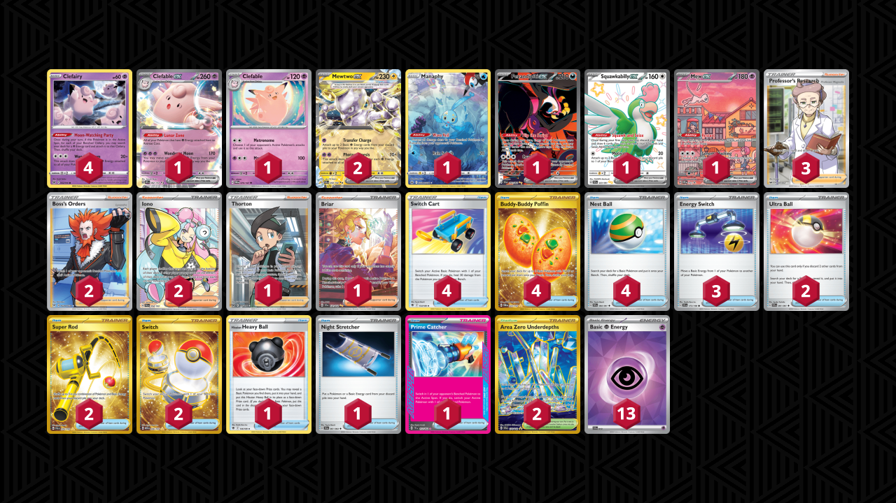

# Clefable/Mewtwo

Tier **5** | Difficulty: **Moderate** | Gameplan: **Aggro Accumulate**

**Source**: Prowlerrs - TrickyGym discord

## List
* 1 Manaphy CRZ-GG 6
* 2 Mewtwo ex PAR 58
* 4 Clefairy LOR 62
* 1 Clefable ex OBF 82
* 1 Fezandipiti ex SFA 92
* 1 Squawkabilly ex PAF 223
* 1 Mew ex PR-SV 53
* 1 Clefable TWM 79
* 4 Switch Cart ASR 154
* 2 Ultra Ball PAF 91
* 3 Energy Switch SVI 173
* 1 Hisuian Heavy Ball ASR 146
* 2 Super Rod PAL 276
* 2 Boss's Orders LOR-TG 24
* 1 Night Stretcher SFA 61
* 1 Thorton LOR 195
* 4 Buddy-Buddy Poffin TWM 223
* 1 Prime Catcher TEF 157
* 2 Iono PAL 254
* 1 Briar SCR 171
* 2 Area Zero Underdepths SCR 174
* 4 Nest Ball PAF 84
* 2 Switch MEW 206
* 3 Professor's Research SSH 201
* 13 Basic {P} Energy SVE 13
