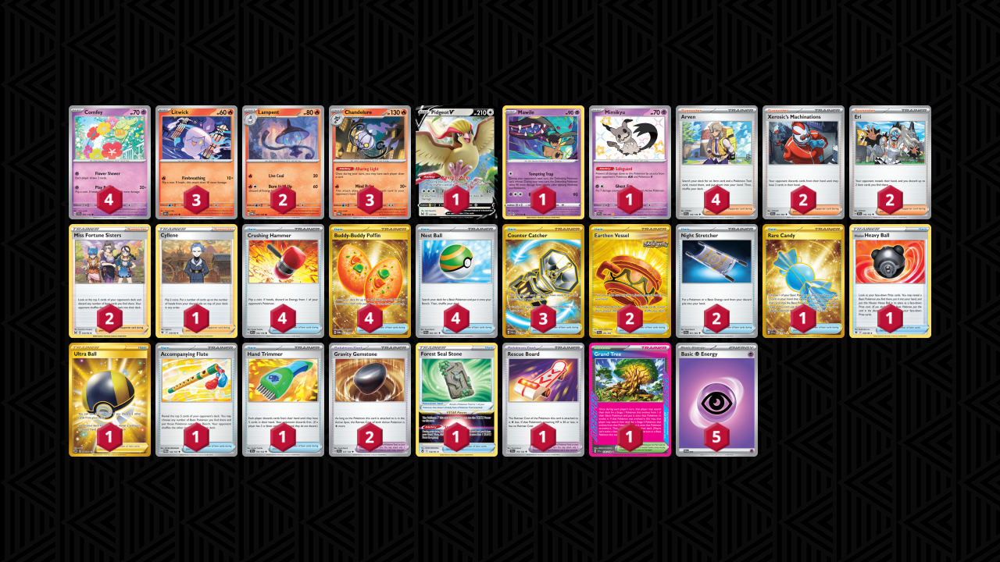

# Comfey Mill

* [Neutralization Zone](#neutralization-zone)
* [Alluring Light Chandelure](#alluring-light-chandelure)

## Neutralization Zone

Tier **5** | Difficulty: **Hard** | Gameplan: **Mill**

**Source**: Stückrath - TrickyGym discord

[top](#comfey-mill)

### List
* 1 Manaphy CRZ-GG 6
* 1 Pidgeot V LOR 137
* 1 Mawile LOR 71
* 1 Mimikyu PAF 160
* 4 Comfey SCR 63
* 4 Arven SVI 235
* 2 Xerosic's Machinations SFA 89
* 2 Earthen Vessel SFA 96
* 4 Crushing Hammer SVI 168
* 3 Eri TEF 210
* 1 Hisuian Heavy Ball ASR 146
* 1 Super Rod PAL 276
* 2 Gravity Gemstone SCR 137
* 1 PokéStop PGO 68
* 1 Miss Fortune Sisters LOR 194
* 1 Cyllene ASR 183
* 2 Night Stretcher SFA 61
* 3 Artazon OBF 229
* 1 Lost Vacuum LOR 217
* 2 Hand Trimmer TEF 150
* 2 Pokégear 3.0 SVI 186
* 4 Buddy-Buddy Poffin TWM 223
* 1 Pal Pad SVI 182
* 1 Forest Seal Stone SIT 156
* 1 Rescue Board TEF 159
* 3 Counter Catcher PAR 264
* 4 Nest Ball PAF 84
* 1 Neutralization Zone SFA 60
* 5 Basic {P} Energy SVE 5

## Alluring Light Chandelure

Tier **F** | Difficulty: **Hard** | Gameplan: **Mill**

**Source**: RabootTCG - [Twitter post](https://x.com/RabootTCG/status/1836730726521159869)

[top](#comfey-mill)

### List
* 3 Litwick OBF 36
* 1 Pidgeot V LOR 137
* 1 Mawile LOR 71
* 3 Chandelure TWM 38
* 1 Mimikyu PAF 160
* 4 Comfey SCR 63
* 2 Lampent TWM 37
* 1 Rare Candy SVI 256
* 2 Xerosic's Machinations SFA 64
* 2 Earthen Vessel SFA 96
* 4 Crushing Hammer SVI 168
* 2 Eri TEF 146
* 1 Hisuian Heavy Ball ASR 146
* 1 Grand Tree SCR 136
* 2 Gravity Gemstone SCR 137
* 1 Ultra Ball BRS 186
* 2 Night Stretcher SFA 61
* 1 Accompanying Flute TWM 142
* 1 Cyllene ASR 138
* 2 Miss Fortune Sisters LOR 164
* 1 Hand Trimmer TEF 150
* 4 Buddy-Buddy Poffin TWM 223
* 1 Forest Seal Stone SIT 156
* 1 Rescue Board TEF 159
* 3 Counter Catcher PAR 264
* 4 Nest Ball PAF 84
* 4 Arven SVI 166
* 5 Basic {P} Energy SVE 5
