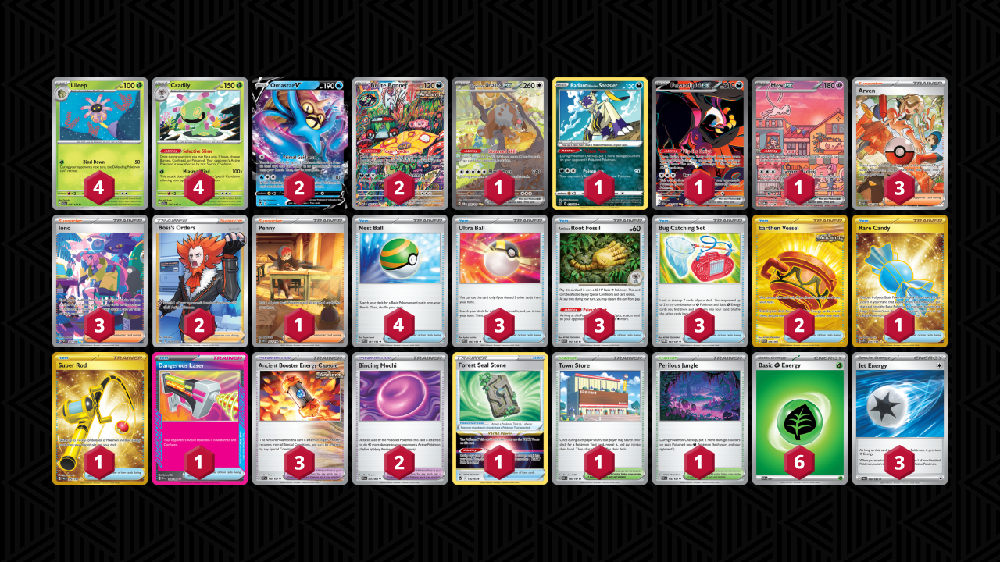

# Cradily/Omastar

Tier **F** | Difficulty: **Medium** | Gameplan: **Midrange**

**Source**: TrustYourPilot Pokemon - [YouTube video](www.youtube.com/watch?v=Gjh170_pem4)

## List
* 1 Bloodmoon Ursaluna ex TWM 216
* 2 Omastar V SIT 35
* 4 Cradily SCR 6
* 2 Brute Bonnet PAR 207
* 1 Radiant Hisuian Sneasler LOR 123
* 1 Fezandipiti ex SFA 92
* 1 Mew ex PR-SV 53
* 4 Lileep SCR 5
* 1 Rare Candy SVI 256
* 3 Ultra Ball SVI 196
* 1 Penny SVI 252
* 2 Earthen Vessel SFA 96
* 3 Antique Root Fossil SCR 130
* 3 Ancient Booster Energy Capsule TEF 140
* 3 Arven PAF 235
* 3 Iono PAF 237
* 1 Super Rod PAL 276
* 2 Boss's Orders LOR-TG 24
* 1 Dangerous Laser SFA 58
* 1 Town Store OBF 196
* 1 Perilous Jungle TEF 156
* 1 Forest Seal Stone SIT 156
* 4 Nest Ball SVI 181
* 3 Bug Catching Set TWM 143
* 2 Binding Mochi SFA 55
* 6 Basic {G} Energy SVE 1
* 3 Jet Energy PAL 190
