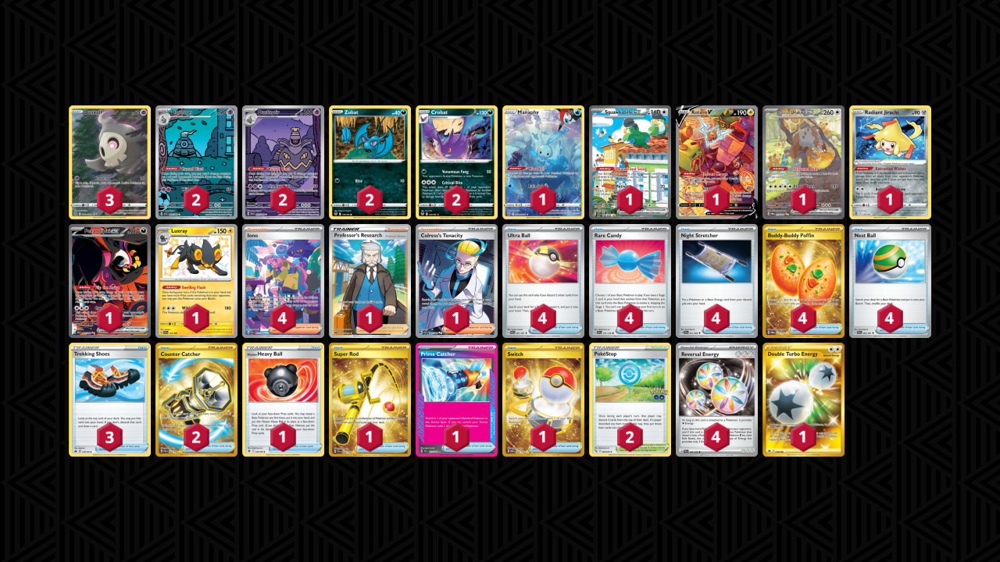

# Crobat/Dusknoir

Tier **5** | Difficulty: **Extreme** | Gameplan: **Spread Combo**

**Source**: kyle_pyke - [Twitter post](https://x.com/kyle_pyke/status/1843006970292531699)

## List
* 1 Manaphy CRZ-GG 6
* 1 Squawkabilly ex PAL 264
* 1 Rotom V LOR 177
* 1 Bloodmoon Ursaluna ex TWM 216
* 2 Dusclops SFA 69
* 3 Duskull CRZ-GG 28
* 1 Radiant Jirachi SIT 120
* 2 Crobat SIT 105
* 1 Fezandipiti ex SFA 92
* 1 Luxray PAF 137
* 2 Zubat SIT 103
* 2 Dusknoir SFA 70
* 4 Ultra Ball PAF 91
* 4 Rare Candy SVI 191
* 3 Trekking Shoes CRZ 145
* 1 Hisuian Heavy Ball ASR 146
* 1 Super Rod PAL 276
* 4 Iono PAF 237
* 2 PokéStop PGO 68
* 4 Night Stretcher SFA 61
* 1 Professor's Research CRZ 150
* 1 Prime Catcher TEF 157
* 4 Buddy-Buddy Poffin TWM 223
* 1 Colress's Tenacity SFA 87
* 2 Counter Catcher PAR 264
* 4 Nest Ball PAF 84
* 1 Switch MEW 206
* 1 Double Turbo Energy ASR 216
* 4 Reversal Energy PAL 192
