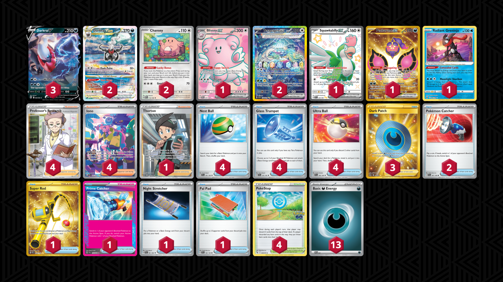

# Darkrai/Terapagos

Tier **4** | Difficulty: **Moderate** | Gameplan: **Midrange**

**Source**: CantoN09y - [Top 32 Late Night 205](https://play.limitlesstcg.com/tournament/66cfa774bf2ffe05f5992806/player/canton09y/decklist)

## List
* 1 Squawkabilly ex PAF 223
* 2 Darkrai VSTAR CRZ-GG 50
* 2 Chansey MEW 113
* 2 Terapagos ex SCR 170
* 3 Darkrai V ASR 98
* 1 Pecharunt ex SFA 95
* 1 Radiant Greninja ASR 46
* 1 Blissey ex TWM 201
* 4 PokéStop PGO 68
* 1 Super Rod PAL 276
* 1 Prime Catcher TEF 157
* 2 Pokémon Catcher SVI 187
* 1 Night Stretcher SFA 61
* 1 Pal Pad SVI 182
* 4 Nest Ball SVI 181
* 4 Professor's Research SSH 201
* 4 Iono PAF 237
* 1 Thorton LOR 195
* 3 Dark Patch LOR 216
* 4 Glass Trumpet SCR 135
* 4 Ultra Ball SVI 196
* 13 Basic {D} Energy SVE 7
