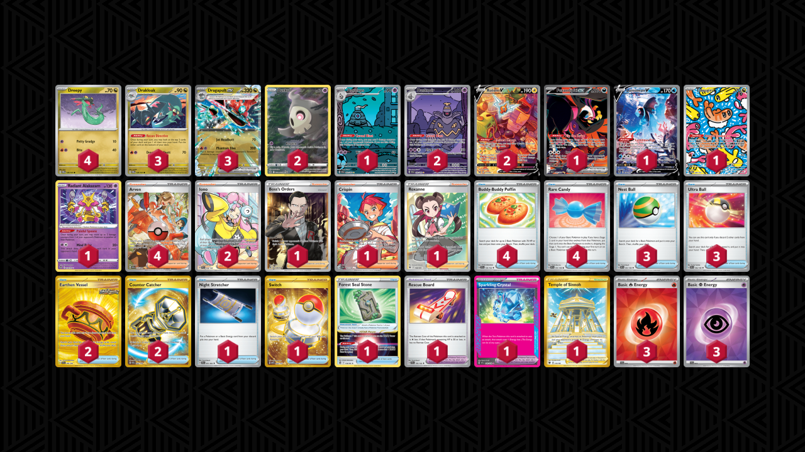
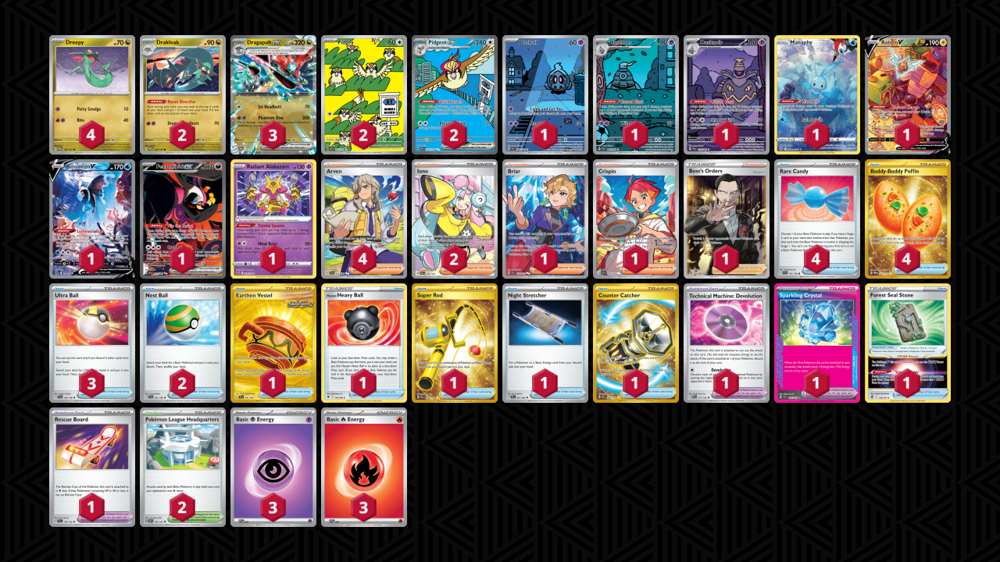
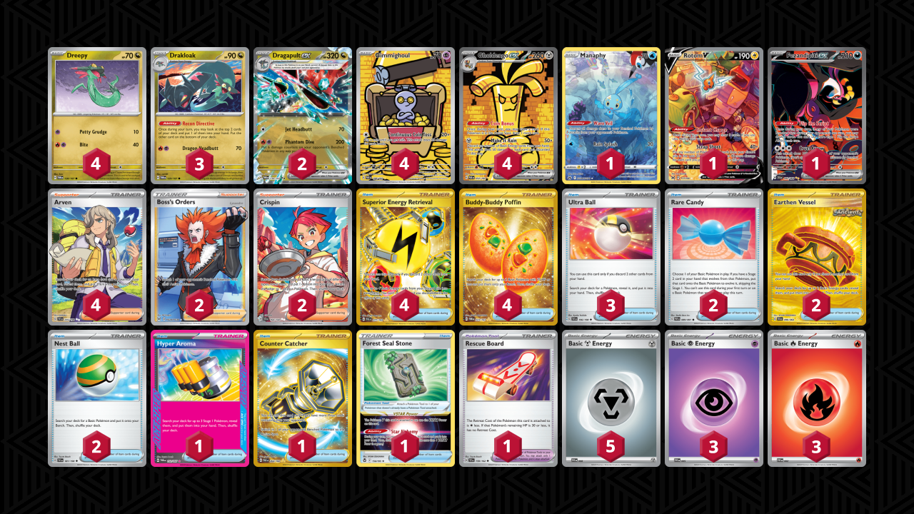

# Dragapult ex

* [Cursed Blast Dusknoir](#cursed-blast-dusknoir)
* [Pidgeot ex](#pidgeot-ex)
* [Iron Thorns ex](#iron-thorns-ex)
* [Gholdengo ex](#gholdengo-ex)

## Cursed Blast Dusknoir

Tier **1** | Difficulty: **Hard** | Gameplan: **Accumulate Spread**

**Source**: Ryuki Okada - [1st Place Regional Dortmund](https://limitlesstcg.com/decks/list/12973)

[top](#dragapult-ex)

### List
* 1 Fezandipiti ex SFA 92
* 3 Drakloak TWM 129
* 4 Dreepy TWM 128
* 2 Rotom V LOR 177
* 1 Lumineon V BRS 156
* 2 Duskull CRZ-GG 28
* 1 Dusclops SFA 69
* 1 Tatsugiri TWM 186
* 2 Dusknoir SFA 70
* 3 Dragapult ex TWM 130
* 1 Radiant Alakazam SIT 59
* 1 Boss's Orders RCL 189
* 1 Crispin SCR 164
* 2 Iono PAL 254
* 1 Temple of Sinnoh ASR 214
* 1 Forest Seal Stone SIT 156
* 1 Roxanne ASR 188
* 2 Earthen Vessel SFA 96
* 1 Night Stretcher SFA 61
* 1 Rescue Board TEF 159
* 3 Nest Ball SVI 181
* 4 Arven PAF 235
* 1 Switch MEW 206
* 2 Counter Catcher PAR 264
* 4 Buddy-Buddy Poffin TEF 144
* 3 Ultra Ball SVI 196
* 1 Sparkling Crystal SCR 142
* 4 Rare Candy SVI 191
* 3 Basic {R} Energy SVE 10
* 3 Basic {P} Energy SVE 13

## Pidgeot ex

Tier **1** | Difficulty: **Hard** | Gameplan: **Accumulate Spread**

**Source**: punkstar026 - [1st Place Happy's PokéLeague (Stellar Crown)](https://play.limitlesstcg.com/tournament/66e0cb13beaddc6f2ee507a7/player/punkstar026/decklist)

[top](#dragapult-ex)

### List
* 1 Manaphy CRZ-GG 6
* 1 Rotom V LOR 177
* 2 Drakloak TWM 129
* 4 Dreepy TWM 128
* 2 Pidgeot ex OBF 225
* 3 Dragapult ex TWM 130
* 1 Dusclops SFA 69
* 2 Pidgey OBF 207
* 1 Duskull SFA 68
* 1 Lumineon V BRS 156
* 1 Fezandipiti ex SFA 92
* 1 Radiant Alakazam SIT 59
* 1 Dusknoir SFA 70
* 3 Ultra Ball SVI 196
* 4 Arven SVI 235
* 1 Earthen Vessel SFA 96
* 4 Rare Candy SVI 191
* 1 Hisuian Heavy Ball ASR 146
* 1 Super Rod PAL 276
* 1 Technical Machine: Devolution PAR 177
* 1 Night Stretcher SFA 61
* 1 Briar SCR 163
* 1 Crispin SCR 164
* 4 Buddy-Buddy Poffin TWM 223
* 2 Pokémon League Headquarters OBF 192
* 1 Sparkling Crystal SCR 142
* 2 Iono PAL 254
* 1 Forest Seal Stone SIT 156
* 2 Nest Ball SVI 181
* 1 Rescue Board TEF 159
* 1 Counter Catcher PAR 264
* 1 Boss's Orders RCL 189
* 3 Basic {P} Energy SVE 5
* 3 Basic {R} Energy SVE 2

## Iron Thorns ex

Tier **3** | Difficulty: **Hard** | Gameplan: **Accumulate Disruption Spread**

**Source**: PawnArtTCG - [2nd Place CHALLENGE OF DOOM! FUN SIZED!](https://play.limitlesstcg.com/tournament/66fc25f5a23f2120819d29a0/player/pawnarttcg/decklist)

[top](#dragapult-ex)

### List
* 3 Drakloak TWM 129
* 3 Dreepy TWM 128
* 3 Dragapult ex TWM 130
* 4 Iron Thorns ex TWM 77
* 1 Radiant Charizard CRZ 20
* 1 Earthen Vessel SFA 96
* 4 Arven OBF 186
* 4 Crispin SCR 133
* 3 Iono PAL 185
* 1 Ultra Ball BRS 186
* 2 Night Stretcher SFA 61
* 2 Future Booster Energy Capsule PAR 164
* 2 Technical Machine: Evolution PAR 178
* 4 Pokégear 3.0 SVI 186
* 2 Buddy-Buddy Poffin TWM 223
* 1 Prime Catcher TEF 157
* 1 Penny SVI 183
* 3 Nest Ball SVI 181
* 1 Rescue Board TEF 159
* 3 Boss's Orders PAL 172
* 4 Basic {L} Energy SVE 12
* 4 Basic {R} Energy SVE 10
* 4 Basic {P} Energy SVE 13

## Gholdengo ex

Tier **4** | Difficulty: **Hard** | Gameplan: **Accumulate Midrange Spread**

**Source**: Tier4チャンネル - [YouTube video](www.youtube.com/watch?v=aqxsxLE9GDQ)

[top](#dragapult-ex)

### List
* 1 Manaphy CRZ-GG 6
* 1 Rotom V LOR 177
* 4 Gholdengo ex PAR 252
* 3 Drakloak TWM 129
* 4 Dreepy TWM 128
* 2 Dragapult ex TWM 130
* 4 Gimmighoul PAR 198
* 1 Fezandipiti ex SFA 92
* 3 Ultra Ball SVI 196
* 2 Rare Candy PAF 89
* 4 Arven SVI 235
* 2 Earthen Vessel SFA 96
* 4 Superior Energy Retrieval PAL 277
* 1 Hyper Aroma TWM 152
* 2 Boss's Orders LOR-TG 24
* 2 Crispin SCR 164
* 4 Buddy-Buddy Poffin TWM 223
* 1 Forest Seal Stone SIT 156
* 2 Nest Ball SVI 181
* 1 Rescue Board TEF 159
* 1 Counter Catcher PAR 264
* 3 Basic {P} Energy SVE 5
* 3 Basic {R} Energy SVE 2
* 5 Basic {M} Energy SVE 8
