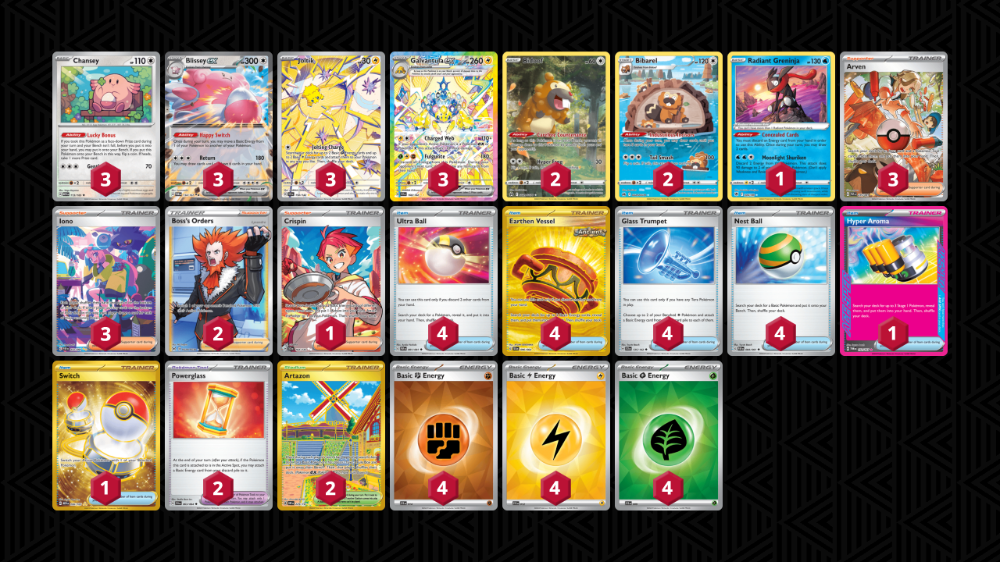
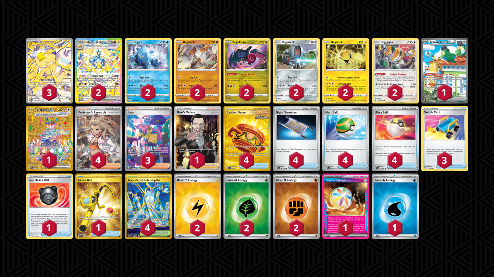

# Galvantula ex

* [Blissey ex](#blissey-ex)
* [Industrious Incisors Bibarel](#industrious-incisors-bibarel)
* [Ancient Wisdom Regigigas](#ancient-wisdom-regigigas)

## Blissey ex

Tier **5** | Difficulty: **Medium** | Gameplan: **Disruption**

**Source**: The_Verd29 - [Twitter post](https://x.com/The_Verd29/status/1831665588919554355)

[top](#galvantula-ex)

### List
* 3 Chansey MEW 113
* 3 Joltik SCR 150
* 3 Galvantula ex SCR 168
* 3 Blissey ex TWM 134
* 2 Bibarel CRZ-GG 25
* 1 Radiant Greninja ASR 46
* 2 Bidoof CRZ-GG 29
* 2 Powerglass SFA 63
* 4 Ultra Ball PAF 91
* 4 Earthen Vessel SFA 96
* 4 Glass Trumpet SCR 135
* 3 Arven PAF 235
* 3 Iono PAF 237
* 1 Hyper Aroma TWM 152
* 2 Boss's Orders LOR-TG 24
* 2 Artazon OBF 229
* 1 Crispin SCR 164
* 4 Nest Ball PAF 84
* 1 Switch MEW 206
* 4 Basic {F} Energy SVE 14
* 4 Basic {L} Energy SVE 12
* 4 Basic {G} Energy SVE 9

## Industrious Incisors Bibarel

Tier **5** | Difficulty: **Medium** | Gameplan: **Disruption**

**Source**: Azul Garcia Griego - [YouTube video](https://www.youtube.com/watch?v=pjpkjQgmwHc)

[top](#galvantula-ex)

### List
* 1 Skwovet SVI 222
* 3 Galvantula ex SCR 168
* 4 Bibarel CRZ-GG 25
* 2 Fan Rotom SCR 118
* 4 Joltik SCR 50
* 3 Bidoof CRZ-GG 29
* 4 Ultra Ball SVI 196
* 3 Powerglass SFA 63
* 4 Energy Switch SVI 173
* 4 Crispin SCR 133
* 4 Glass Trumpet SCR 135
* 2 Super Rod PAL 276
* 4 Iono PAF 237
* 2 Boss's Orders LOR-TG 24
* 4 Buddy-Buddy Poffin TWM 223
* 1 Counter Catcher PAR 264
* 1 Unfair Stamp TWM 165
* 3 Basic {F} Energy SVE 14
* 4 Basic {L} Energy SVE 12
* 3 Basic {G} Energy SVE 9

## Ancient Wisdom Regigigas

Tier **F** | Difficulty: **Medium** | Gameplan: **Disruption**

**Source**: Greninjaboi - [Late Night 205](https://play.limitlesstcg.com/tournament/66cfa774bf2ffe05f5992806/player/greninjaboi/decklist)

[top](#galvantula-ex)

### List
* 2 Galvantula ex SCR 168
* 2 Regice ASR 37
* 2 Regirock ASR 75
* 2 Regidrago ASR 118
* 2 Registeel ASR 108
* 2 Regieleki ASR 51
* 3 Joltik SCR 150
* 1 Squawkabilly ex PAL 264
* 1 Terapagos ex SCR 173
* 2 Regigigas ASR 130
* 1 Boss's Orders RCL 189
* 1 Hisuian Heavy Ball ASR 146
* 3 Switch Cart ASR 154
* 1 Super Rod PAL 276
* 4 Earthen Vessel SFA 96
* 4 Night Stretcher SFA 61
* 4 Nest Ball SVI 181
* 3 Iono PAF 237
* 4 Area Zero Underdepths SCR 174
* 4 Professor's Research SVI 240
* 4 Ultra Ball SVI 196
* 2 Basic {L} Energy SVE 12
* 1 Legacy Energy TWM 167
* 2 Basic {G} Energy SVE 9
* 1 Basic {W} Energy SVE 11
* 2 Basic {F} Energy SVE 14
