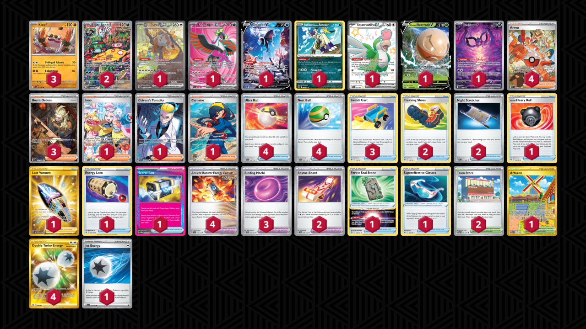

# Klawf/Electrode

Tier **2** | Difficulty: **Moderate** | Gameplan: **Aggro Turbo**

**Source**: Alejandro Luciano Eijo - [3rd Place Regional Joinville](https://limitlesstcg.com/decks/list/12922)

## List
* 1 Bloodmoon Ursaluna ex TWM 216
* 1 Fezandipiti ex SFA 84
* 2 Brute Bonnet PAR 207
* 1 Lumineon V BRS 156
* 1 Radiant Hisuian Sneasler LOR 123
* 1 Squawkabilly ex PAF 223
* 1 Hisuian Electrode V PR-SW 294
* 1 Pecharunt PR-SV 129
* 3 Klawf PAR 105
* 4 Ultra Ball SVI 196
* 3 Switch Cart ASR 154
* 3 Boss's Orders PAL 265
* 4 Ancient Booster Energy Capsule TEF 140 PH
* 2 Trekking Shoes ASR 156
* 1 Hisuian Heavy Ball ASR 146
* 4 Arven PAF 235
* 1 Iono PAL 269
* 2 Night Stretcher SFA 61
* 1 Artazon OBF 229
* 1 Lost Vacuum LOR 217
* 2 Town Store OBF 196
* 1 Energy Loto ASR 140
* 1 Colress's Tenacity SFA 87
* 1 Forest Seal Stone SIT 156
* 4 Nest Ball SVI 181
* 2 Rescue Board TEF 159
* 1 Secret Box TWM 163
* 1 Supereffective Glasses ASR 152
* 1 Carmine TWM 204
* 3 Binding Mochi SFA 55
* 4 Double Turbo Energy ASR 216
* 1 Jet Energy PAL 190
