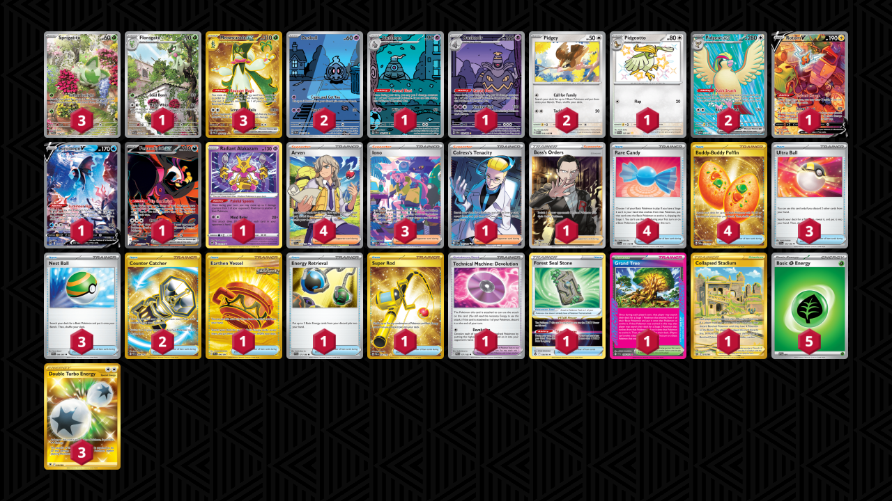

# Meowscarada/Dusknoir

Tier **5** | Difficulty: **Hard** | Gameplan: **Accumulate Spread**

**Source**: KostasKun - TrickyGym discord

## List
* 1 Pidgeotto PAF 197
* 1 Rotom V LOR 177
* 3 Meowscarada ex PAL 271
* 1 Dusclops SFA 69
* 2 Duskull SFA 68
* 1 Lumineon V BRS 156
* 1 Fezandipiti ex SFA 92
* 1 Radiant Alakazam SIT 59
* 1 Floragato PAL 197
* 3 Sprigatito PAL 196
* 1 Dusknoir SFA 70
* 2 Pidgey MEW 16
* 2 Pidgeot ex OBF 217
* 3 Ultra Ball SVI 196
* 4 Arven SVI 235
* 1 Earthen Vessel SFA 96
* 4 Rare Candy SVI 191
* 1 Energy Retrieval SVI 171
* 1 Grand Tree SCR 136
* 1 Super Rod PAL 276
* 3 Iono PAF 237
* 1 Technical Machine: Devolution PAR 177
* 4 Buddy-Buddy Poffin TWM 223
* 1 Colress's Tenacity SFA 87
* 1 Forest Seal Stone SIT 156
* 1 Collapsed Stadium LOR 215
* 2 Counter Catcher PAR 264
* 3 Nest Ball PAF 84
* 1 Boss's Orders RCL 189
* 3 Double Turbo Energy ASR 216
* 5 Basic {G} Energy SVE 1
