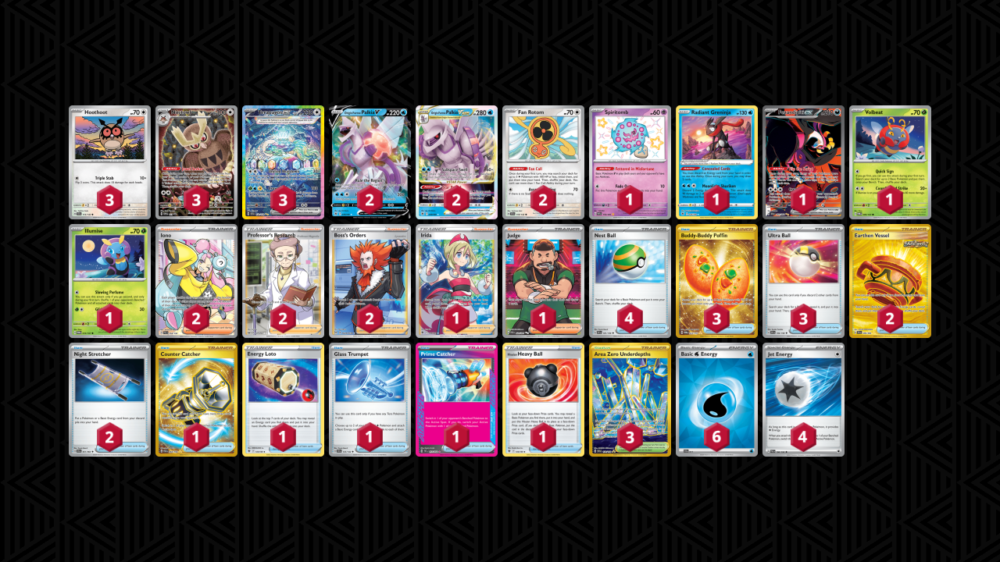

# Palkia/Noctowl

Tier **2** | Difficulty: **Hard** | Gameplan: **Midrange**

**Source**: Oscar Madsen - [Top 16 Regional Gdańsk](https://limitlesstcg.com/decks/list/13530)

## List
* 3 Hoothoot SCR 114
* 3 Terapagos ex SCR 170
* 1 Spiritomb PAF 158
* 2 Origin Forme Palkia V ASR 39
* 2 Origin Forme Palkia VSTAR ASR 40
* 2 Fan Rotom SCR 118
* 1 Radiant Greninja ASR 46
* 1 Fezandipiti ex SFA 92
* 1 Volbeat TWM 9
* 1 Illumise TWM 10
* 3 Noctowl PR-SV 141
* 2 Iono PAL 254
* 2 Professor's Research SSH 201
* 2 Boss's Orders LOR-TG 24
* 1 Irida ASR 186
* 1 Judge PAF 228
* 3 Buddy-Buddy Poffin TWM 223
* 4 Nest Ball SVI 181
* 3 Ultra Ball SVI 196
* 2 Earthen Vessel SFA 96
* 2 Night Stretcher SFA 61
* 1 Counter Catcher PAR 264
* 1 Energy Loto ASR 140
* 1 Glass Trumpet SCR 135
* 1 Prime Catcher TEF 157
* 3 Area Zero Underdepths SCR 174
* 1 Hisuian Heavy Ball ASR 146
* 6 Basic {W} Energy SVE 11
* 4 Jet Energy PAL 190
