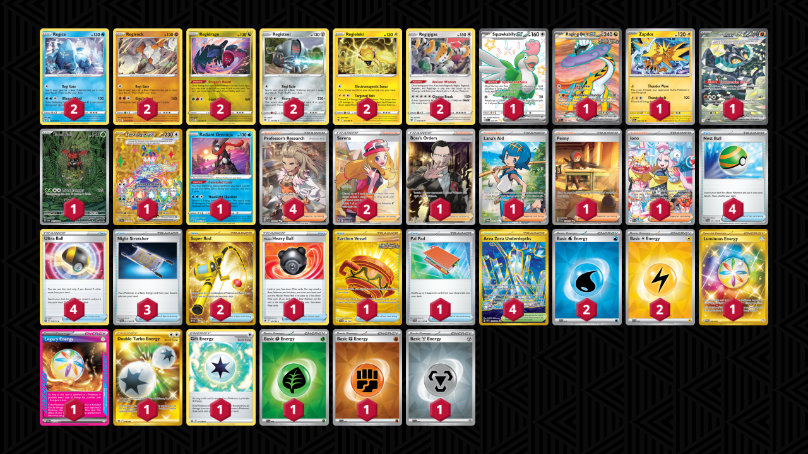

# Regis

Tier **4** | Difficulty: **Hard** | Gameplan: **Toolbox**

**Source**: N/A - Day 1 Regional Louisville, KY

## List
* 1 Squawkabilly ex PAF 223
* 2 Regice ASR 37
* 1 Raging Bolt ex TEF 196
* 1 Zapdos TWM 65
* 2 Regirock ASR 75
* 2 Regidrago ASR 118
* 2 Registeel ASR 108
* 2 Regieleki ASR 51
* 1 Cornerstone Mask Ogerpon ex TWM 215
* 1 Tapu Bulu SFA 65
* 1 Terapagos ex SCR 173
* 2 Regigigas ASR 130
* 1 Radiant Greninja ASR 46
* 1 Boss's Orders RCL 189
* 1 Lana's Aid TWM 207
* 1 Hisuian Heavy Ball ASR 146
* 2 Super Rod PAL 276
* 1 Earthen Vessel SFA 96
* 1 Penny SVI 252
* 3 Night Stretcher SFA 61
* 2 Serena SIT 193
* 1 Pal Pad SVI 182
* 4 Nest Ball SVI 181
* 4 Ultra Ball BRS 150
* 4 Area Zero Underdepths SCR 174
* 1 Iono PAL 269
* 4 Professor's Research SVI 240
* 1 Luminous Energy TWM 226
* 1 Legacy Energy TWM 167
* 1 Double Turbo Energy ASR 216
* 1 Gift Energy LOR 171
* 1 Basic {G} Energy SVE 9
* 2 Basic {W} Energy SVE 11
* 2 Basic {L} Energy SVE 12
* 1 Basic {F} Energy SVE 14
* 1 Basic {M} Energy SVE 16
