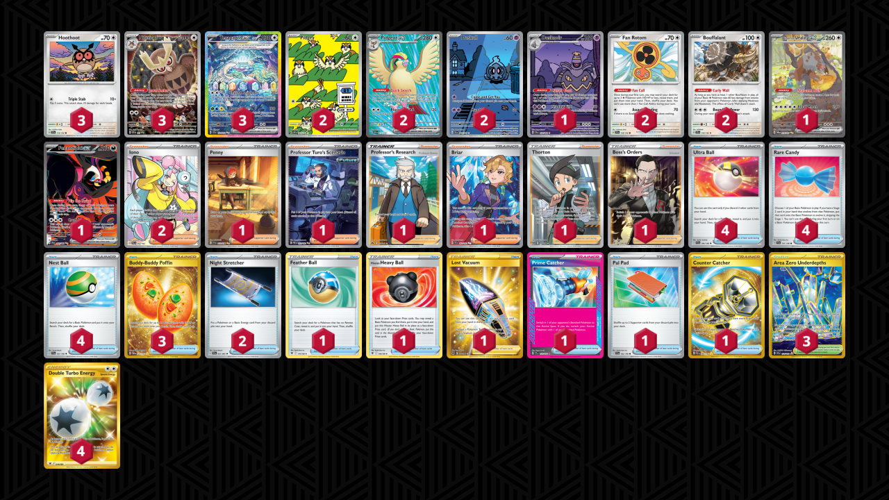

# Terapagos/Dusknoir

Tier **1** | Difficulty: **Extreme** | Gameplan: **Midrange**

**Source**: Tord Reklev - [2nd Place Regional Gdańsk](https://limitlesstcg.com/decks/list/13522)

## List
* 1 Bloodmoon Ursaluna ex TWM 216
* 2 Pidgey OBF 207
* 2 Duskull SFA 68
* 3 Hoothoot SCR 114
* 1 Fezandipiti ex SFA 92
* 2 Fan Rotom SCR 118
* 2 Bouffalant SCR 119
* 3 Terapagos ex SCR 170
* 3 Noctowl PR-SV 141
* 1 Dusknoir SFA 70
* 2 Pidgeot ex OBF 217
* 4 Ultra Ball SVI 196
* 1 Penny SVI 252
* 4 Rare Candy SVI 191
* 1 Feather Ball ASR 141
* 1 Hisuian Heavy Ball ASR 146
* 1 Professor Turo's Scenario PAR 257
* 2 Night Stretcher SFA 61
* 1 Professor's Research CRZ 150
* 1 Briar SCR 163
* 1 Lost Vacuum LOR 217
* 1 Thorton LOR 195
* 3 Buddy-Buddy Poffin TWM 223
* 1 Prime Catcher TEF 157
* 1 Pal Pad SVI 182
* 2 Iono PAL 254
* 4 Nest Ball SVI 181
* 3 Area Zero Underdepths SCR 174
* 1 Counter Catcher PAR 264
* 1 Boss's Orders RCL 189
* 4 Double Turbo Energy ASR 216
