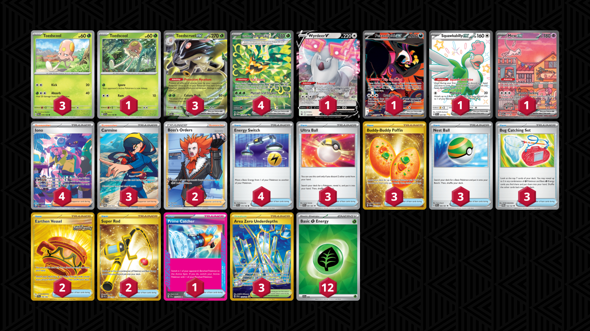

# Toedscruel/Ogerpon

Tier **5** | Difficulty: **Moderate** | Gameplan: **Midrange**

**Source**: N/A

## List
* 1 Wyrdeer V ASR 134
* 4 Teal Mask Ogerpon ex TWM 211
* 3 Toedscruel ex OBF 22
* 1 Toedscool SVI 25
* 3 Toedscool PAR 16
* 1 Fezandipiti ex SFA 92
* 1 Squawkabilly ex PAF 223
* 1 Mew ex PR-SV 53
* 3 Ultra Ball PAF 91
* 2 Earthen Vessel SFA 96
* 4 Energy Switch SVI 173
* 2 Super Rod PAL 276
* 4 Iono PAF 237
* 2 Boss's Orders LOR-TG 24
* 1 Prime Catcher TEF 157
* 3 Buddy-Buddy Poffin TWM 223
* 3 Area Zero Underdepths SCR 174
* 3 Nest Ball PAF 84
* 3 Carmine TWM 204
* 3 Bug Catching Set TWM 143
* 12 Basic {G} Energy SVE 9
