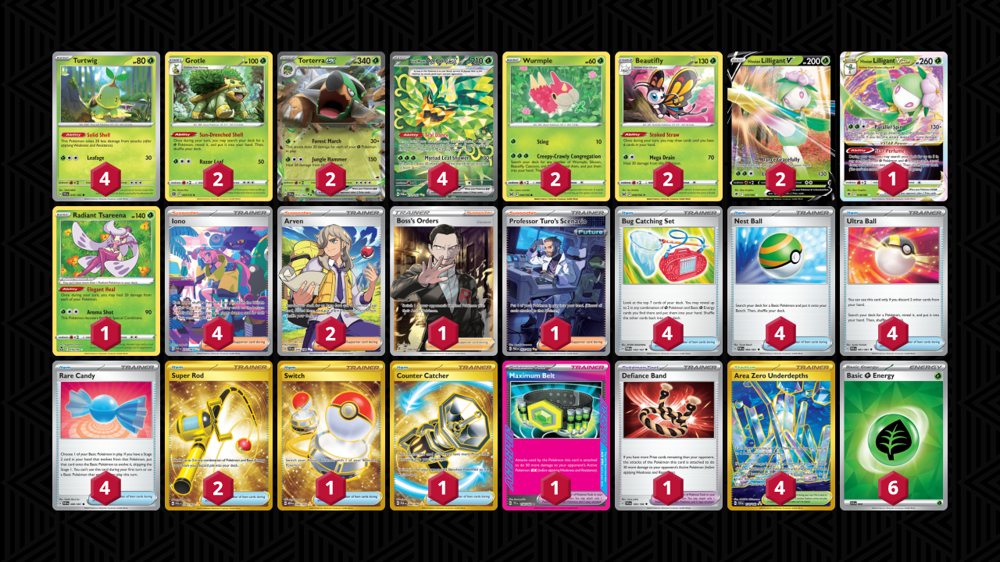

# Torterra/Ogerpon

Tier **5** | Difficulty: **Moderate** | Gameplan: **Midrange**

**Source**: Andrew Mahone - [YouTube video](https://www.youtube.com/watch?v=O3w-OmLJC7E)

## List
* 2 Wurmple LOR 6
* 4 Turtwig TEF 10
* 1 Hisuian Lilligant VSTAR ASR 18
* 2 Torterra ex TEF 12
* 2 Grotle BRS 7
* 2 Hisuian Lilligant V ASR 17
* 4 Teal Mask Ogerpon ex TWM 211
* 2 Beautifly LOR 8
* 1 Radiant Tsareena SIT 16
* 1 Boss's Orders RCL 189
* 4 Bug Catching Set TWM 143
* 2 Super Rod PAL 276
* 4 Nest Ball PAF 84
* 1 Professor Turo's Scenario PAR 257
* 4 Ultra Ball PAF 91
* 1 Maximum Belt TEF 154
* 4 Iono PAF 237
* 1 Switch MEW 206
* 4 Area Zero Underdepths SCR 174
* 2 Arven SVI 235
* 1 Defiance Band SVI 169
* 4 Rare Candy PAF 89
* 1 Counter Catcher PAR 264
* 6 Basic {G} Energy SVE 9
