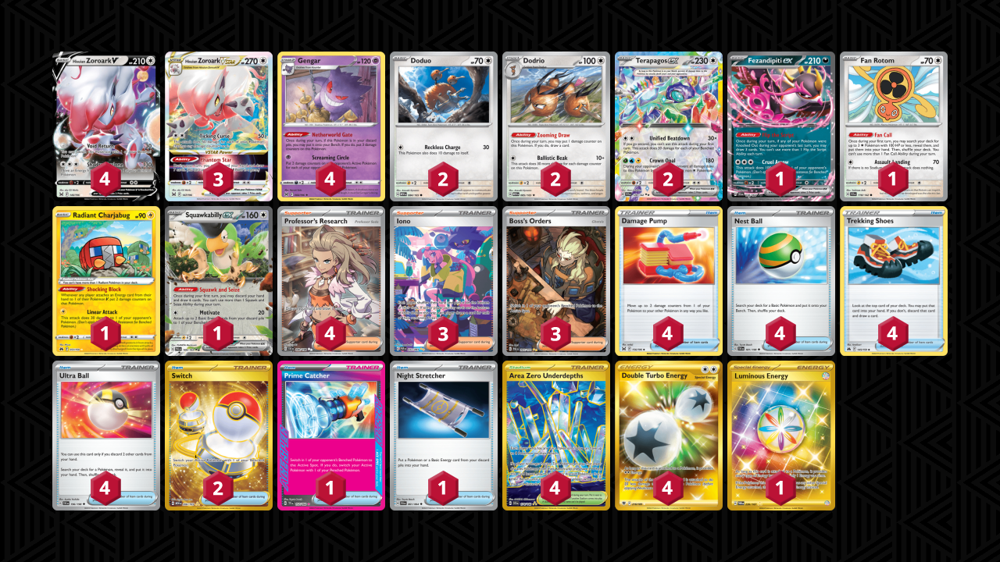

# Zoroark/Terapagos

Tier **4** | Difficulty: **Moderate** | Gameplan: **Midrange**

**Source**: Azul Garcia Griego - [YouTube video](https://www.youtube.com/watch?v=C4aYs8UNvrw)

## List
* 4 Hisuian Zoroark V LOR 146
* 2 Doduo MEW 84
* 2 Terapagos ex SCR 128
* 2 Dodrio MEW 85
* 1 Fezandipiti ex SFA 38
* 3 Hisuian Zoroark VSTAR LOR 147
* 4 Gengar LOR 66
* 1 Fan Rotom SCR 118
* 1 Radiant Charjabug CRZ 51
* 1 Squawkabilly ex PAL 169
* 4 Damage Pump LOR 156
* 1 Prime Catcher TEF 157
* 1 Night Stretcher SFA 61
* 4 Nest Ball SVI 181
* 3 Iono PAF 237
* 2 Switch MEW 206
* 3 Boss's Orders PAL 265
* 4 Area Zero Underdepths SCR 174
* 4 Trekking Shoes CRZ 145
* 4 Professor's Research SVI 240
* 4 Ultra Ball SVI 196
* 1 Luminous Energy TWM 226
* 4 Double Turbo Energy ASR 216
