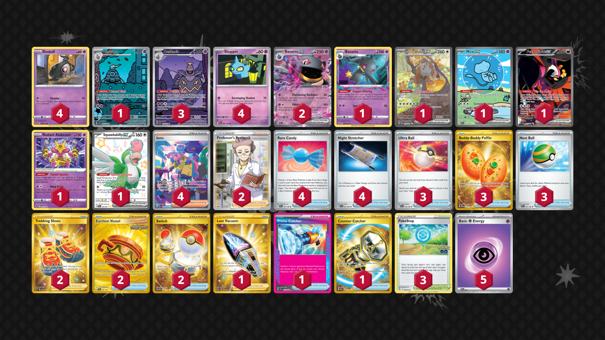

# Banette/Dusknoir

Tier **3** | Difficulty: **Hard** | Gameplan: **Combo Disruption**

**Source**: Zelda Z. - [Top 8 Regional Toronto (JR)](https://limitlesstcg.com/decks/list/14898)

## List
* 4 Duskull BRS 60
* 1 Banette LOR 73
* 1 Bloodmoon Ursaluna ex TWM 216
* 4 Shuppet SVI 87
* 1 Mew ex PAF 232
* 1 Dusclops SFA 69
* 1 Fezandipiti ex SFA 92
* 1 Radiant Alakazam SIT 59
* 1 Squawkabilly ex PAF 223
* 2 Banette ex SVI 88
* 3 Dusknoir SFA 70
* 3 Ultra Ball SVI 196
* 2 Trekking Shoes ASR 215
* 2 Earthen Vessel SFA 96
* 4 Rare Candy SVI 191
* 4 Iono PAF 237
* 3 PokéStop PGO 68
* 4 Night Stretcher SFA 61
* 1 Lost Vacuum LOR 217
* 3 Buddy-Buddy Poffin TWM 223
* 1 Prime Catcher TEF 157
* 3 Nest Ball SVI 181
* 1 Counter Catcher PAR 264
* 2 Switch MEW 206
* 2 Professor's Research SSH 201
* 5 Basic {P} Energy SVE 5