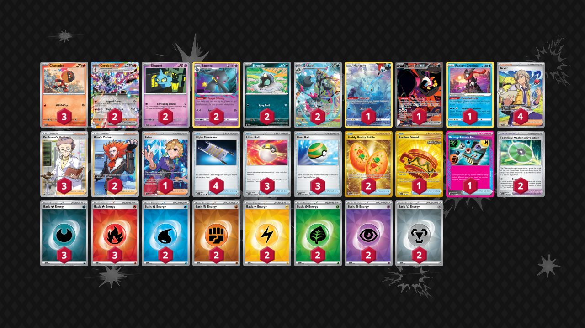

# Ceruledge/Grafaiai

Tier **F** | Difficulty: **Moderate** | Gameplan: **Midrange**

**Source**: Oscar Madsen - [Twitter post](https://x.com/StecherCro/status/1870494491226018014)

## List
* 1 Manaphy CRZ-GG 6
* 2 Banette LOR 73
* 2 Shuppet SVI 87
* 2 Ceruledge ex SSP 36
* 1 Fezandipiti ex SFA 92
* 2 Grafaiai PAL 223
* 1 Radiant Greninja ASR 46
* 2 Shroodle SSP 120
* 3 Charcadet SSP 32
* 4 Arven SVI 235
* 3 Ultra Ball PAF 91
* 1 Earthen Vessel SFA 96
* 1 Energy Search Pro SSP 176
* 2 Boss's Orders LOR-TG 24
* 4 Night Stretcher SFA 61
* 2 Technical Machine: Evolution PAR 178
* 1 Briar SCR 163
* 2 Buddy-Buddy Poffin TWM 223
* 3 Nest Ball PAF 84
* 3 Professor's Research SSH 201
* 2 Basic {W} Energy SVE 11
* 2 Basic {F} Energy SVE 14
* 2 Basic {L} Energy SVE 12
* 3 Basic {D} Energy SVE 15
* 3 Basic {R} Energy SVE 10
* 2 Basic {G} Energy SVE 9
* 2 Basic {P} Energy SVE 13
* 2 Basic {M} Energy SVE 16