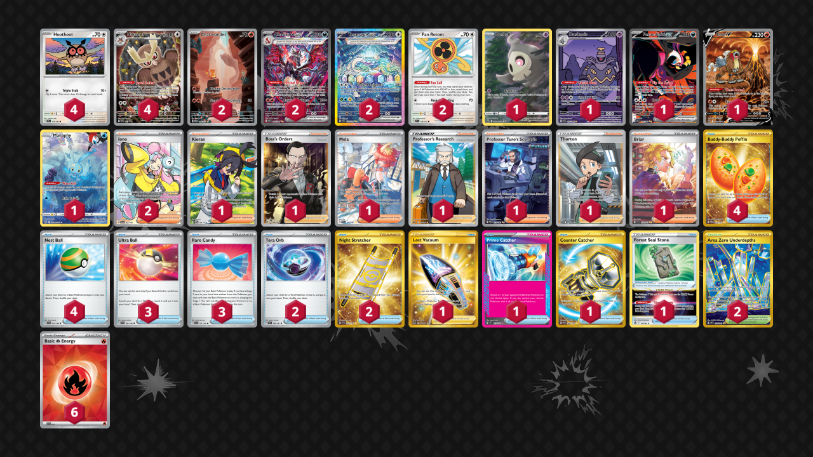

# Charizard/Noctowl

Tier **3** | Difficulty: **Hard** | Gameplan: **Accumulate**

**Source**: Stéphane Ivanoff - [Top 128 Regional Stuttgart](https://limitlesstcg.com/decks/list/14559)

## List
* 1 Fezandipiti ex SFA 92
* 2 Charmander MEW 168
* 4 Noctowl PR-SV 141
* 1 Entei V CRZ-GG 36
* 1 Manaphy CRZ-GG 6
* 2 Charizard ex PAF 234
* 1 Duskull CRZ-GG 28
* 2 Terapagos ex SCR 170
* 4 Hoothoot SCR 114
* 2 Fan Rotom SCR 118
* 1 Dusknoir SFA 70
* 1 Kieran TWM 206
* 1 Boss's Orders RCL 189
* 4 Buddy-Buddy Poffin TWM 223
* 1 Lost Vacuum LOR 217
* 2 Iono PAL 254
* 2 Tera Orb SSP 189
* 1 Forest Seal Stone SIT 156
* 1 Mela PAR 254
* 1 Professor's Research CRZ 150
* 1 Professor Turo's Scenario PAR 257
* 1 Prime Catcher TEF 157
* 4 Nest Ball SVI 181
* 1 Thorton LOR 195
* 2 Night Stretcher SSP 251
* 1 Briar SCR 171
* 2 Area Zero Underdepths SCR 174
* 1 Counter Catcher PAR 264
* 3 Ultra Ball SVI 196
* 3 Rare Candy SVI 191
* 6 Basic {R} Energy SVE 10