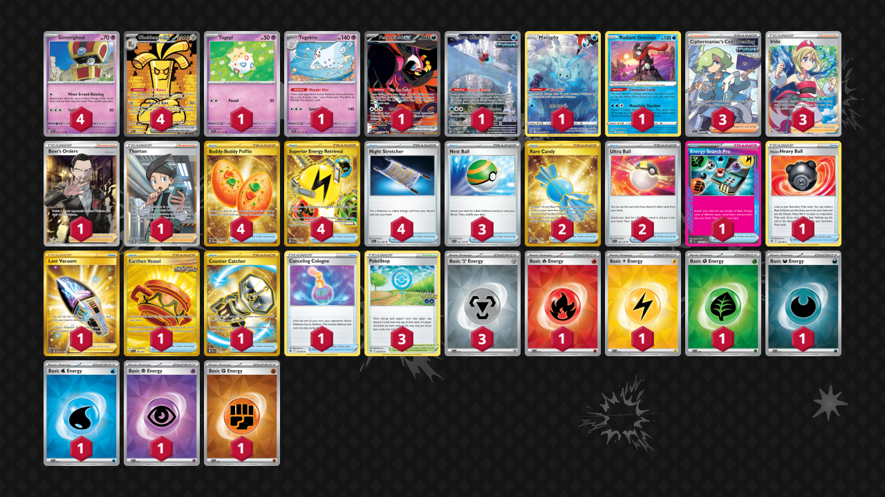

# Gholdengo/Togekiss

Tier **2** | Difficulty: **Moderate** | Gameplan: **Midrange**

**Source**: Victor de Velasco - [3rd Place Regional Sacramento, CA](https://limitlesstcg.com/decks/list/14206)

## List
* 1 Fezandipiti ex SFA 92
* 1 Togepi SSP 70
* 1 Togekiss SSP 72
* 4 Gholdengo ex PAR 252
* 1 Iron Bundle PR-SV 66
* 1 Manaphy CRZ-GG 6
* 4 Gimmighoul SSP 97
* 1 Radiant Greninja ASR 46
* 1 Energy Search Pro SSP 176
* 1 Boss's Orders RCL 189
* 1 Hisuian Heavy Ball ASR 146
* 4 Buddy-Buddy Poffin TWM 223
* 1 Lost Vacuum LOR 217
* 3 PokéStop PGO 68
* 4 Superior Energy Retrieval PAL 277
* 3 Ciphermaniac's Codebreaking TEF 198
* 1 Earthen Vessel SFA 96
* 2 Rare Candy SVI 256
* 4 Night Stretcher SFA 61
* 3 Nest Ball SVI 181
* 1 Thorton LOR 195
* 1 Counter Catcher PAR 264
* 3 Irida ASR 186
* 2 Ultra Ball SVI 196
* 1 Canceling Cologne ASR 136
* 1 Basic {R} Energy SVE 10
* 1 Basic {L} Energy SVE 12
* 1 Basic {G} Energy SVE 9
* 1 Basic {D} Energy SVE 15
* 1 Basic {W} Energy SVE 11
* 1 Basic {P} Energy SVE 13
* 1 Basic {F} Energy SVE 14
* 3 Basic {M} Energy SVE 16