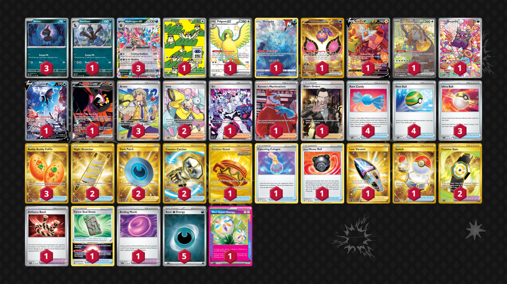

# Hydreigon/Pidgeot

Tier **3** | Difficulty: **Hard** | Gameplan: **Accumulate Disruption**

**Source**: Juan Mora - [Top 128 Regional Sacramento, CA](https://limitlesstcg.com/decks/list/14272)

## List
* 1 Manaphy CRZ-GG 6
* 1 Pecharunt ex SFA 95
* 1 Rotom V LOR 177
* 3 Hydreigon ex SSP 119
* 1 Zweilous SSP 118
* 3 Deino SSP 117
* 1 Bloodmoon Ursaluna ex TWM 216
* 1 Morpeko PAR 206
* 1 Pidgey OBF 207
* 1 Lumineon V BRS 156
* 1 Fezandipiti ex SFA 92
* 1 Pidgeot ex PAF 221
* 3 Ultra Ball SVI 196
* 3 Arven SVI 235
* 1 Earthen Vessel SFA 96
* 4 Rare Candy SVI 191
* 1 Canceling Cologne ASR 136
* 1 Defiance Band SVI 169
* 1 Hisuian Heavy Ball ASR 146
* 2 Night Stretcher SSP 251
* 1 Eri TEF 210
* 1 Xerosic's Machinations SFA 89
* 1 Lost Vacuum LOR 217
* 3 Buddy-Buddy Poffin TWM 223
* 2 Iono PAL 254
* 1 Forest Seal Stone SIT 156
* 4 Nest Ball SVI 181
* 2 Dark Patch LOR 216
* 2 Counter Catcher PAR 264
* 2 Counter Gain SSP 249
* 1 Boss's Orders RCL 189
* 1 Binding Mochi SFA 55
* 1 Switch MEW 206
* 5 Basic {D} Energy SVE 15
* 1 Neo Upper Energy TEF 162