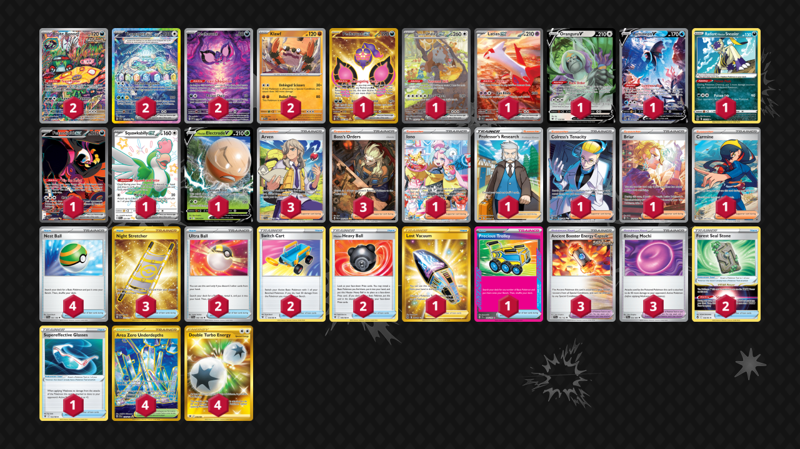

# Klawf/Terapagos

Tier **1** | Difficulty: **Hard** | Gameplan: **Aggro**

**Source**: Richard Yannow - [Top 32 Regional Sacramento, CA](https://limitlesstcg.com/decks/list/14216)

## List
* 1 Pecharunt ex SFA 95
* 1 Bloodmoon Ursaluna ex TWM 216
* 1 Latias ex SSP 239
* 2 Brute Bonnet PAR 207
* 1 Oranguru V ASR 133
* 1 Lumineon V BRS 156
* 1 Radiant Hisuian Sneasler LOR 123
* 1 Fezandipiti ex SFA 92
* 2 Terapagos ex SCR 170
* 1 Squawkabilly ex PAF 223
* 1 Hisuian Electrode V PR-SW 294
* 2 Pecharunt PR-SV 129
* 2 Klawf PAR 105
* 2 Ultra Ball SVI 196
* 3 Arven SVI 235
* 2 Switch Cart ASR 154
* 3 Boss's Orders PAL 265
* 3 Ancient Booster Energy Capsule TEF 140
* 2 Hisuian Heavy Ball ASR 146
* 1 Iono PAL 269
* 3 Night Stretcher SSP 251
* 1 Professor's Research CRZ 150
* 1 Lost Vacuum LOR 217
* 2 Forest Seal Stone SIT 156
* 1 Colress's Tenacity SFA 87
* 4 Nest Ball SVI 181
* 1 Briar SCR 171
* 4 Area Zero Underdepths SCR 174
* 1 Supereffective Glasses ASR 152
* 1 Carmine TWM 204
* 1 Precious Trolley SSP 185
* 3 Binding Mochi SFA 55
* 4 Double Turbo Energy ASR 216