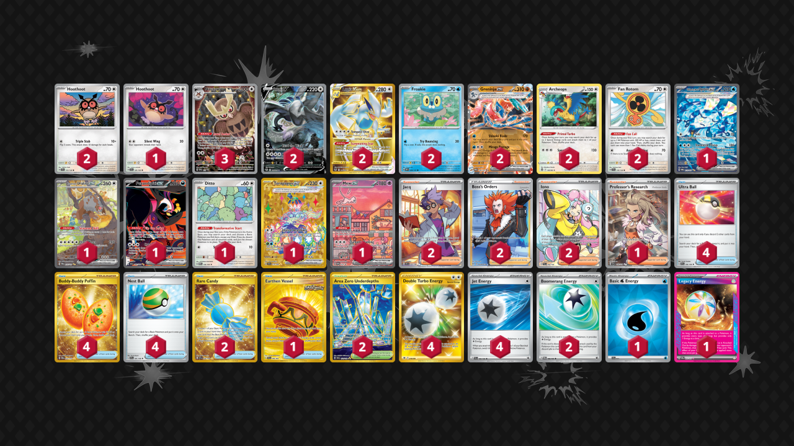

# Lugia/Greninja

Tier **3** | Difficulty: **Hard** | Gameplan: **Midrange Spread**

**Source**: Noah Schuler - [Top 64 Regional Sacramento, CA](https://limitlesstcg.com/decks/list/14238)

## List
* 1 Wellspring Mask Ogerpon ex TWM 213
* 1 Bloodmoon Ursaluna ex TWM 216
* 2 Archeops SIT 147
* 2 Greninja ex TWM 106
* 2 Lugia V SIT 186
* 1 Hoothoot TEF 126
* 2 Lugia VSTAR SIT 211
* 2 Hoothoot SCR 114
* 1 Fezandipiti ex SFA 92
* 1 Ditto MEW 132
* 2 Fan Rotom SCR 118
* 1 Terapagos ex SCR 173
* 1 Mew ex PR-SV 53
* 3 Noctowl PR-SV 141
* 2 Froakie OBF 56
* 2 Rare Candy SVI 256
* 4 Ultra Ball SVI 196
* 1 Earthen Vessel SFA 96
* 2 Jacq SVI 236
* 2 Boss's Orders LOR-TG 24
* 1 Professor's Research SVI 240
* 4 Buddy-Buddy Poffin TWM 223
* 2 Iono PAL 254
* 4 Nest Ball SVI 181
* 2 Area Zero Underdepths SCR 174
* 1 Basic {W} Energy SVE 11
* 4 Double Turbo Energy ASR 216
* 1 Legacy Energy TWM 167
* 2 Boomerang Energy TWM 166
* 4 Jet Energy PAL 190