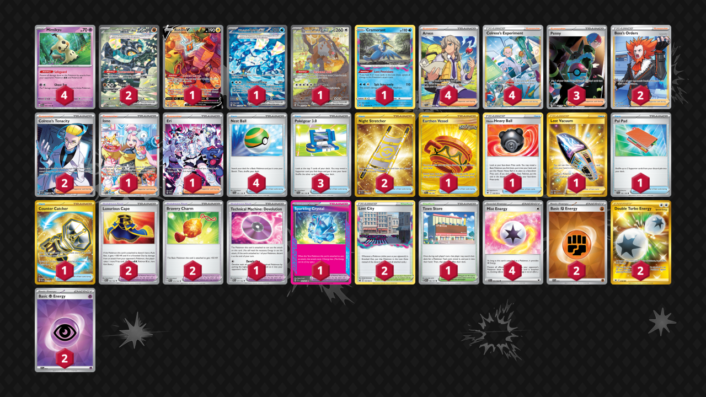

# Ogerpon/Mimikyu

* [Sparkling Crystal](#sparkling-crystal)
* [Hero's Cape](#heros-cape)

## Sparkling Crystal

Tier **3** | Difficulty: **Hard** | Gameplan: **Turbo Stall**

**Source**: Joshua Frink - [Top 128 Regional Sacramento, CA](https://limitlesstcg.com/decks/list/14248)

[top](#ogerponmimikyu)

## List
* 1 Rotom V LOR 177
* 1 Wellspring Mask Ogerpon ex TWM 213
* 1 Bloodmoon Ursaluna ex TWM 216
* 2 Cornerstone Mask Ogerpon ex TWM 215
* 1 Cramorant LOR 50
* 4 Mimikyu PAL 97
* 4 Arven SVI 235
* 1 Earthen Vessel SFA 96
* 1 Hisuian Heavy Ball ASR 146
* 2 Luxurious Cape PAR 166
* 2 Lost City LOR 161
* 1 Iono PAL 269
* 2 Night Stretcher SSP 251
* 3 Penny PAF 239
* 1 Technical Machine: Devolution PAR 177
* 2 Boss's Orders LOR-TG 24
* 1 Eri TEF 210
* 1 Lost Vacuum LOR 217
* 1 Town Store OBF 196
* 3 Pokégear 3.0 SVI 186
* 1 Pal Pad SVI 182
* 1 Sparkling Crystal SCR 142
* 2 Colress's Tenacity SFA 87
* 4 Nest Ball SVI 181
* 1 Counter Catcher PAR 264
* 2 Bravery Charm PAL 173
* 4 Colress's Experiment CRZ-GG 59
* 4 Mist Energy TEF 161
* 2 Basic {F} Energy SVE 14
* 2 Double Turbo Energy ASR 216
* 2 Basic {P} Energy SVE 13

## Hero's Cape

Tier **3** | Difficulty: **Hard** | Gameplan: **Stall**

**Source**: Joshie207 - [Jefferson Gym Tuesday Night Standard #16](https://play.limitlesstcg.com/tournament/67256caf0947ec3b5d190de1/player/joshie207/decklist)

[top](#ogerponmimikyu)

## List
* 1 Diancie SCR 86
* 2 Cornerstone Mask Ogerpon ex TWM 215
* 2 Noivern ex PAL 153
* 2 Noibat PAL 152
* 4 Mimikyu PAL 97
* 1 Hisuian Heavy Ball ASR 146
* 4 Arven PAF 235
* 3 Luxurious Cape PAR 166
* 1 Iono PAL 269
* 3 Night Stretcher SSP 251
* 3 Penny PAF 239
* 1 Ultra Ball BRS 186
* 2 Boss's Orders LOR-TG 24
* 1 Artazon OBF 229
* 1 Hero's Cape TEF 152
* 1 Xerosic's Machinations SFA 89
* 1 Crispin SCR 164
* 1 Town Store OBF 196
* 3 Pokégear 3.0 SVI 186
* 1 Buddy-Buddy Poffin TWM 223
* 1 Pal Pad SVI 182
* 2 Colress's Tenacity SFA 87
* 3 Nest Ball SVI 181
* 1 Bravery Charm SCR 175
* 1 Counter Catcher PAR 264
* 1 Lively Stadium SSP 180
* 3 Colress's Experiment CRZ-GG 59
* 4 Mist Energy TEF 161
* 1 Double Turbo Energy ASR 216
* 3 Basic {P} Energy SVE 5
* 2 Basic {F} Energy SVE 6
