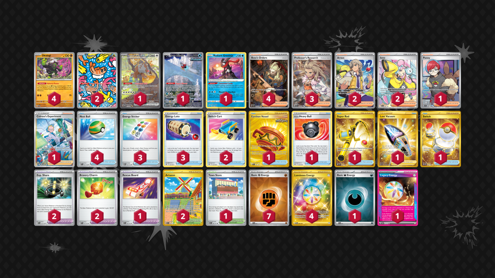

# Adrena-Power Okidogi

Tier **3** | Difficulty: **Moderate** | Gameplan: **Midrange**

**Source**: Icaro Borges - [3rd Place ASRcristiano # 6](https://play.limitlesstcg.com/tournament/6734699057dcc5a683fbf84b/player/mycrosd/decklist)

## List
* 1 Bloodmoon Ursaluna ex TWM 216
* 2 Tatsugiri TWM 186
* 1 Iron Bundle PR-SV 66
* 1 Radiant Greninja ASR 46
* 4 Okidogi TWM 111
* 2 Arven SVI 235
* 2 Switch Cart ASR 154
* 1 Earthen Vessel SFA 96
* 4 Boss's Orders PAL 265
* 2 Exp. Share SVI 174
* 1 Hisuian Heavy Ball ASR 146
* 1 Penny SVI 239
* 1 Super Rod PAL 276
* 2 Artazon OBF 229
* 1 Lost Vacuum LOR 217
* 3 Energy Sticker MEW 159
* 1 Town Store OBF 196
* 3 Professor's Research SVI 240
* 3 Energy Loto ASR 140
* 2 Iono PAL 254
* 4 Nest Ball SVI 181
* 1 Rescue Board TEF 159
* 1 Switch MEW 206
* 2 Bravery Charm PAL 173
* 1 Colress's Experiment CRZ-GG 59
* 7 Basic {F} Energy SVE 14
* 1 Basic {D} Energy SVE 15
* 4 Luminous Energy TWM 226
* 1 Legacy Energy TWM 167