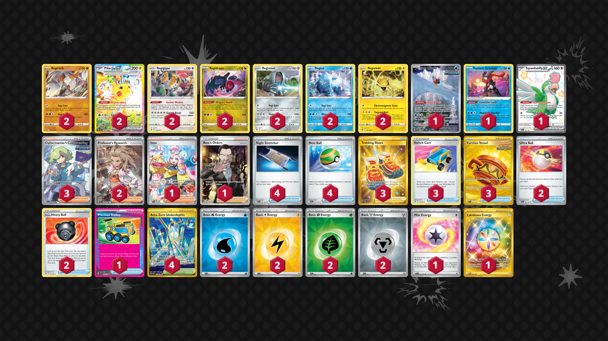

# Pikachu/Regis

Tier **3** | Difficulty: **Hard** | Gameplan: **Combo Midrange**

**Source**: Charlie Lockyer - [Top 128 Regional Sacramento, CA](https://limitlesstcg.com/decks/list/14269)

## List
* 2 Regirock ASR 75
* 2 Pikachu ex SSP 238
* 1 Iron Bundle PR-SV 66
* 2 Regigigas ASR 130
* 2 Regidrago ASR 118
* 2 Registeel ASR 108
* 1 Radiant Greninja ASR 46
* 2 Regice ASR 37
* 1 Squawkabilly ex PAF 223
* 2 Regieleki ASR 51
* 3 Trekking Shoes ASR 215
* 3 Switch Cart ASR 154
* 2 Ultra Ball PAF 91
* 3 Earthen Vessel SFA 96
* 3 Ciphermaniac's Codebreaking TEF 198
* 2 Hisuian Heavy Ball ASR 146
* 1 Iono PAL 269
* 4 Night Stretcher SFA 61
* 2 Professor's Research SVI 240
* 4 Nest Ball SVI 181
* 4 Area Zero Underdepths SCR 174
* 1 Precious Trolley SSP 185
* 1 Boss's Orders RCL 189
* 2 Basic {W} Energy SVE 11
* 1 Mist Energy TEF 161
* 2 Basic {L} Energy SVE 12
* 2 Basic {G} Energy SVE 9
* 1 Luminous Energy TWM 226
* 2 Basic {M} Energy SVE 16