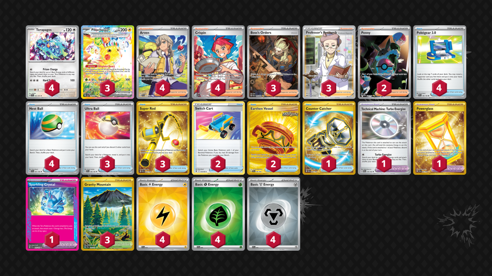

# Pikachu/Terapagos

Tier **5** | Difficulty: **Moderate** | Gameplan: **Midrange**

**Source**: Evan Campbell - [Twitter post](https://x.com/tcg_evan/status/1855622652641116648)

## List
* 4 Terapagos SSP 161
* 3 Pikachu ex SSP 238
* 3 Ultra Ball SVI 196
* 4 Arven SVI 235
* 2 Switch Cart ASR 154
* 2 Earthen Vessel SFA 96
* 3 Boss's Orders PAL 265
* 3 Super Rod PAL 276
* 3 Gravity Mountain SSP 250
* 2 Penny PAF 239
* 1 Technical Machine: Turbo Energize PAR 179
* 4 Crispin SCR 164
* 4 Pokégear 3.0 SVI 186
* 1 Powerglass SFA 97
* 1 Sparkling Crystal SCR 142
* 4 Nest Ball SVI 181
* 1 Counter Catcher PAR 264
* 3 Professor's Research SSH 201
* 4 Basic {L} Energy SVE 12
* 4 Basic {G} Energy SVE 9
* 4 Basic {M} Energy SVE 16