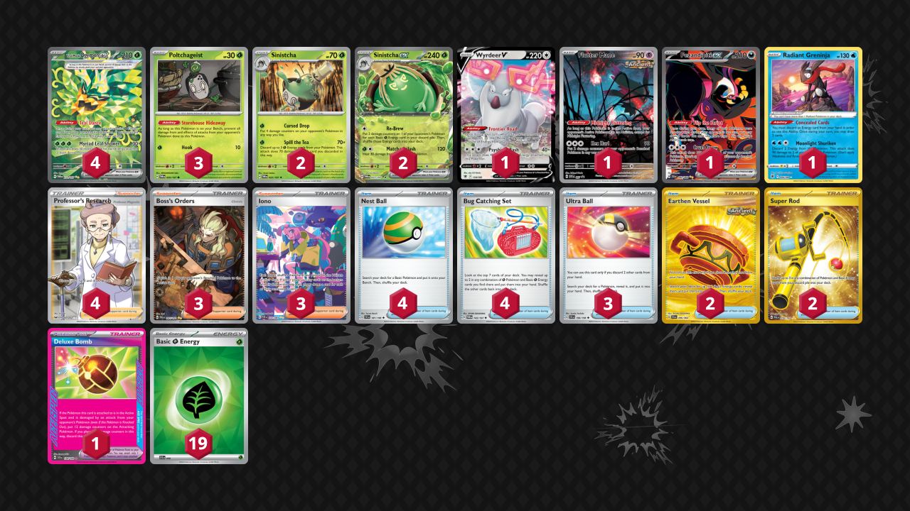

# Sinistcha/Ogerpon

Tier **4** | Difficulty: **Moderate** | Gameplan: **Midrange Turbo**

**Source**: mandommika - [1st Place TOURNAMENT OF DOOM! Oh no....](https://play.limitlesstcg.com/tournament/end-of-year/player/mandommika/decklist)

## List
* 1 Wyrdeer V ASR 134
* 2 Sinistcha TWM 22
* 4 Teal Mask Ogerpon ex TWM 211
* 3 Poltchageist TWM 20
* 2 Sinistcha ex TWM 23
* 1 Flutter Mane PR-SV 97
* 1 Fezandipiti ex SFA 92
* 1 Radiant Greninja ASR 46
* 3 Ultra Ball SVI 196
* 2 Earthen Vessel SFA 96
* 3 Boss's Orders PAL 265
* 1 Deluxe Bomb SCR 134
* 2 Super Rod PAL 276
* 3 Iono PAF 237
* 4 Nest Ball SVI 181
* 4 Bug Catching Set TWM 143
* 4 Professor's Research SSH 201
* 19 Basic {G} Energy SVE 9