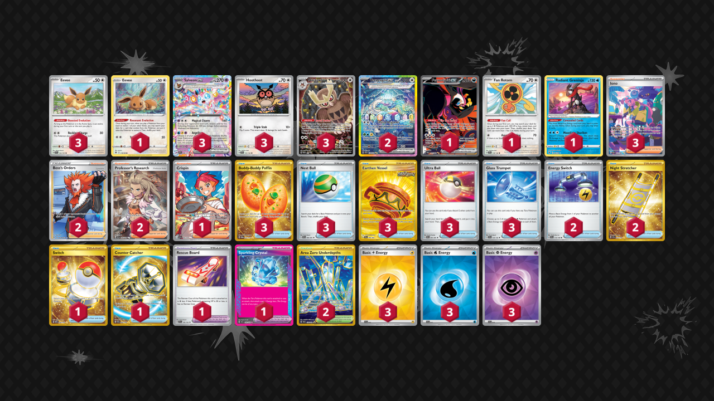

# Sylveon/Terapagos

Tier **4** | Difficulty: **Hard** | Gameplan: **Disruption Midrange**

**Source**: justinbasil - [Website](https://www.justinbasil.com/new-decks/sv8#sylveonex)

## List
* 3 Sylveon ex SSP 86
* 1 Fezandipiti ex SFA 92
* 3 Noctowl PR-SV 141
* 3 Eevee SSP 143
* 2 Terapagos ex SCR 170
* 3 Hoothoot SCR 114
* 1 Fan Rotom SCR 118
* 1 Radiant Greninja ASR 46
* 1 Eevee ASR 119
* 3 Buddy-Buddy Poffin TWM 223
* 1 Crispin SCR 164
* 3 Nest Ball PAF 84
* 2 Boss's Orders LOR-TG 24
* 2 Energy Switch SVI 173
* 3 Earthen Vessel SFA 96
* 3 Ultra Ball PAF 91
* 1 Rescue Board TEF 159
* 3 Iono PAF 237
* 1 Switch MEW 206
* 2 Night Stretcher SSP 251
* 2 Area Zero Underdepths SCR 174
* 1 Counter Catcher PAR 264
* 3 Glass Trumpet SCR 135
* 2 Professor's Research SVI 240
* 1 Sparkling Crystal SCR 142
* 3 Basic {L} Energy SVE 12
* 3 Basic {W} Energy SVE 11
* 3 Basic {P} Energy SVE 13